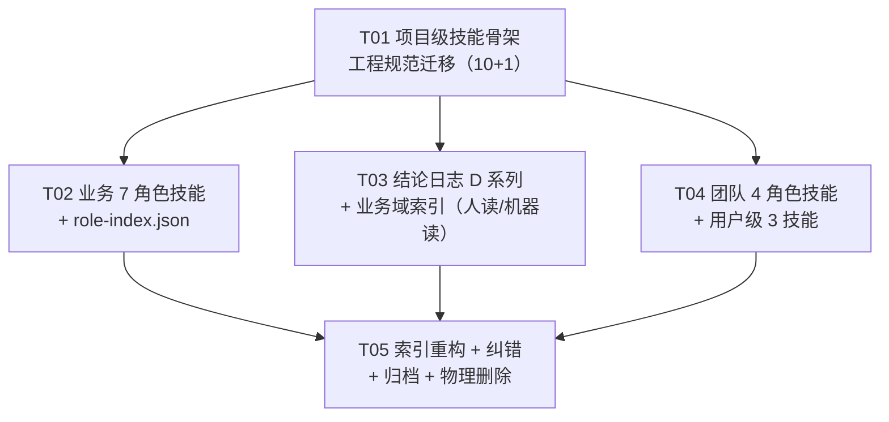

# loan-main 知识治理体系设计

> **作者**：高见远（Gao）· 架构师
> **日期**：2026-08-31
> **状态**：设计稿（本轮只产出设计，不改动任何现有文件）
> **范围**：A 文档索引结构 · B 技能（skills）体系结构 · C 迁移与清理计划 · D 实施任务分解

---

## 0. 设计依据（本轮代码勘察事实）

以下结论均**以代码为准**核实过；凡文档与代码冲突，一律以代码为准。

| # | 事实 | 核实方式 | 影响 |
|---|------|---------|------|
| F1 | `db/loan-db-schema.sql` 表数 = **68** | `grep -c "CREATE TABLE"` | 全库表数**一律表述为「以 `db/loan-db-schema.sql` 为准（当前 68 张 `t_` 表）」**，不引 65（见 F23） |
| F2 | 后端源包 `com.loan.*` 共 **46 个包**（含空包 8 个） | `find -maxdepth 1 -type d` | 业务域划分依据 |
| F3 | **空包（0 个 .java）**：`vip` `stats` `oss` `crm` `match` `job` `enums` `interceptor` | 逐包计数 | 这 8 个"业务域"目前**无实现**，索引须标注 |
| F4 | `AdminAuthInterceptor` 实际位于 **`infrastructure/interceptor/`**，不在空的 `interceptor/` 包 | `find -name` | 索引"鉴权"域须指向 `infrastructure` |
| F5 | **`MiniRoleGuard` 审批白名单（真值）**：`APPROVER_ROLES=[OPERATOR,SUPER_ADMIN,SUPER,BOSS]`（ALLOCATION 用）；`APPROVAL_ROLES=[BOSS,DEPT_MANAGER,OPERATOR,SUPER_ADMIN,SUPER]`（PRODUCT/DOWNLOAD 用） | 读 `MiniRoleGuard.java` 全文 | **DEPT_MANAGER 能审 PRODUCT/DOWNLOAD，不能审 ALLOCATION**；ADVISER 两类都不能审 |
| F6 | 后端 `SUPER` 与 `SUPER_ADMIN` **两种写法并存**，都映射为 `role=super` | `MiniAuthController.resolveRoleInfo` | 新增角色校验须同时兼容，否则漏判 |
| F7 | 前端 `resolveRole()` 与后端 `resolveRoleInfo()` 已对齐；**未识别 roleCode 兜底为 `adviser`（最小可用权限）** | 同时读 `store/user.js` 与 `MiniAuthController` | 角色技能须写"兜底=顾问" |
| F8 | `/api/mini/me` 返回 `profile.roleInfo = { userType, roleCode, role }` | `MiniAuthController.me()` | 角色推导的唯一权威链路 |
| F9 | **`TabBar.vue` 渠道 tab 是 4 个**（首页·我的产品·录入客户·我的），而 `01-角色权限模型.md` 写"渠道 3 tab" | 读 `components/TabBar.vue` | **文档错误，待修正** |
| F10 | 小程序页面共 **13 条路由**（pages.json） | `grep '"path"' pages.json` | 域→前端页面映射依据 |
| F11 | Web 端 `src/views/` 共 **18 个视图目录**，`plan(6) report(4) rule(2) reward(2)` 有实现，其余多为单文件占位 | 逐目录计数 | 域→前端页面映射依据 |
| F12 | **项目级 `.workbuddy/` 目录不存在**；`docs/skills/` 不在系统加载路径 | `ls -la .workbuddy` | 现有 11 个技能**形同虚设**，必须迁移 |
| F13 | 用户级 `~/.workbuddy/skills/` 现仅 1 个技能（银行流水信贷审查报告） | `ls ~/.workbuddy/skills/` | 用户级需新建 3 个通用技能 |
| F14 | `docs/skills/service-ops/SKILL.md` **无 YAML frontmatter** | 读首 12 行 | 即便迁移也无法被解析，须补头 |
| F15 | 知识库文件名标 `C1-C19`，实际内容到 **C22** | 读 `06-业务结论沉淀索引` | 文件名与内容不符 |
| F16 | 后端各包 .java 数量 Top：engine(32) plan(27) mini(22) rule(17) report(14) config(14) product(13) org(12) | 逐包计数 | 判断"域的活跃度" |
| F17 | **git 基线已建立**：`b80c965a4837dfcf2fe2249728963980f8a0c54c`，`docs/` 全量 36 文件入库（此前 `docs/plans/` 与 `方案评审定稿纪要.html` 均为 `??` 未跟踪） | `git log` + `git show --stat` | **物理删除已可恢复**，§C 清理计划的前置条件满足（已记为 D8） |
| F18 | **`docs/knowledge-base/artifacts/` 目录在仓库中不存在**，但 README(:41/:50-53) 与 06(:3/:10/:24) 引用了其中 5 个文件 → **5 条死链** | `ls` + `grep -n "artifacts/"` | 索引必须处理这个**归档缺口** |
| F19 | 上述 5 个文件**真实存在**于外部会话目录 `/Users/admin/WorkBuddy/2026-08-25-14-58-50/.workbuddy/artifacts/`（60+ 文件、含 13 个 png 截图与 V2/V3 重复版本） | 逐个 `-f` 验证，5/5 命中 | 是**归档缺口不是文件丢失**；须选择性 copy 入库 |
| F20 | `10-历史结论与决策日志.md` **已由团队建立并持续追加**（现 **17 条**，D13→D0-1 表格倒序） | 读全文 + 逐行提取编号序列 | 本设计原拟的 `D-001` 编号格式**作废**，沿用实际 `D<n>` 格式；**新增编号从 `D14` 起**（见 §0.2）。曾出现 D10 重号，已修复 |
| F21 | **D0-1 分工红线**（长期）：前端（loan-web / 小程序）由用户自己负责，**助手只做后端 loan-service**；定时任务必须 XXL-Job 禁用 `@Scheduled`；业务 ID = 小写前缀 + 32 位随机 | 读 10-日志 D0-1 | **影响 `team-engineer` 技能**（须内置该红线，见 B.2.4） |
| F22 | **D7**：`前端交互逻辑蓝图.html` / `后端·前端逻辑蓝图.html` **从未落盘、不存在**，禁止再引用；契约真源三项 = `db/loan-db-schema.sql` + `loan-service` 代码 + `docs/knowledge-base/` | 读 10-日志 D7 | 索引不得出现"蓝图"指针 |
| F23 | **表数口径**：代码实测 68；`方案评审定稿纪要.html` 已按 D6 全改为 68（:73/:403/:522），但**其第 16 章域级明细加总仍为 65**（差 3 张未定位到域） | 读 10-日志 D6 + engineer 实测 | 索引一律写「以 `db/loan-db-schema.sql` 为准（当前 68 张 `t_` 表）」，**不引 65**，避开未决缺口 |

### 0.2 与已落地产物的对齐说明（重要）

本设计编写期间，团队已先行落地了部分产物，本设计**以既有产物为准进行对齐**，不再重复新建：

| 产物 | 状态 | 本设计的调整 |
|------|------|------------|
| `docs/knowledge-base/10-历史结论与决策日志.md` | **已存在并持续追加**（现 17 条，D13→D0-1 表格倒序） | T03 由"新建"改为"**对齐与追加**"；编号沿用 `D<n>` 格式，**新增从 `D14` 起**；本设计 §B.4.3 的三条已按 team-lead 指令顺延为 **D11（知识治理）/ D12（artifacts）/ D13（渠道 tabBar）**，其中 **D12 已随执行写入日志**，T03 只需补 D11、D13 |
| git 基线 `b80c965` | **已建立** | §C 的物理删除动作解除阻塞，但仍须走 §C.3 确认清单 |
| `docs/knowledge-base/artifacts/` | **缺失**（F18） | 新增 §A.3.1 归档方案与 §C.4 归档清单，纳入 T05 |

> **编号格式对齐（v1.2 修订）**：本设计初稿的 `D-001/D-002/D-003` **作废**，一律用实际文件的 `D<n>` 格式。
> **编号顺延**：team-lead 已占用 D9（表数缺口）与 D10（清理范围扩大），本设计预留的三条**整体上移 2 位**：
> **D11 = 知识治理体系设计**、**D12 = artifacts 归档缺口**、**D13 = 渠道 tabBar 纠错**（严格倒序排列）。
> **下一条新结论从 `D14` 起。**
> **并发风险提示**：多人同时追加 D 条目极易撞号（本次已实际发生 D10 重号）。**追加前必须先读一遍当前最新编号**，禁止凭记忆写号。

### 0.1 四项已拍板决策的贯彻方式

| 决策 | 在设计中的落点 |
|------|--------------|
| ① 技能两处都要 | 项目级 `loan-main/.workbuddy/skills/`（随 git，21 个）+ 用户级 `~/.workbuddy/skills/`（通用工作流 3 个）。前缀约定：`loan-*`（工程）/ `role-*`（业务角色）/ `team-*`（团队角色）；用户级不加前缀，避免同名冲突 |
| ② 角色两套都要 | 业务 7 角色 `role-{customer,channel,adviser,deptmgr,boss,operator,super}` 回答"这个**身份**能干什么"；团队 4 角色 `team-{pm,architect,engineer,qa}` 回答"这个**岗位**怎么干活"。互不混用 |
| ③ 纠错 = 直接修正 + 物理删除 | 修正走 §B.4 自动更新 5 步；删除走 §C.3 确认清单，未勾选确认不执行 |
| ④ 结论日志 | `10-历史结论与决策日志.md` **已由团队建立**（D8→D0-1，12 条）。本设计负责把它接成**强制入口**：被 `loan-knowledge`（项目级，Step 0）与 `change-safety-check`（用户级，L3 路径固化）双重先读，并在 `README.md` 三条铁律 F-1、`00-项目结构与代码地图.md` 顶部、G9 知识治理域三处设指针 |

---

# A. 文档索引结构（按业务域，而非按编号）

## A.1 现状问题（编号制的 5 个病灶）

| # | 问题 | 证据 | 后果 |
|---|------|------|------|
| P1 | **按"文档类型"组织，不按业务域组织** | 00=结构 / 01=权限 / 02=红线 / 03=数据 / 04=API / 05=前端 / 06=结论 / 07=上线 / 08=矩阵 / 09=图谱 | 改一个业务模块（如"报告"）要在 01/03/04/05/06/08 六份文档间横跳 |
| P2 | 编号诱导"按序读"或"全读" | 编号 00-09 天然成序列 | 1114 行全读不现实，按需定位做不到 |
| P3 | **没有决策演进记录** | 06 只有结论快照（C1-C22），无"何时/为何改/被谁取代" | 同一问题反复推翻重做（如"审批中心是否建表"到 C22 才定案） |
| P4 | 文档与代码脱节且无校验 | F9（渠道 tab 数：文档 3 / 代码 4）、F15（文件名 C1-C19 / 内容 C22） | 知识库可信度被侵蚀 |
| P5 | 索引只服务人读，机器不可消费 | README 是纯 Markdown 表格 | 技能无法自动定位"这个模块该读哪几份文档"，只能靠猜 |

## A.2 设计原则

1. **编号文件一律保留不动**（`00`–`09` 文件名、章节号、外部引用不断裂，git 可追溯）。索引是加在编号层之上的**只读导航层**。
2. **索引分人读与机器读两版**：人读 = `README.md` + `11-业务域文档索引.md`；机器读 = `index/domain-index.json` + `index/role-index.json`（供技能直接消费）。
3. **索引是视图不是真源**：索引只放"指针（文件 + 章节锚点）"，规则正文仍只有一处，避免双写漂移。
4. **空包域显式标注**：8 个空包标「⚠️ 无实现」，防止按索引找代码扑空。
5. **索引粒度到章节不到行号**：行号会漂移，章节标题相对稳定。

## A.3 目标目录结构

```
docs/knowledge-base/
├── README.md                          # 【重构】铁律 + 按业务域导航（人读入口）
├── 00-项目结构与代码地图.md            # 保留
├── 01-角色权限模型.md                  # 保留（待修正：渠道 tabBar 3→4，F9）
├── 02-业务红线与编码规范.md            # 保留
├── 03-数据模型（DB schema 索引）.md    # 保留（68 表口径）
├── 04-后端 API 契约.md                # 保留
├── 05-前端工程要点.md                  # 保留
├── 06-业务结论沉淀索引（C1-C19）.md    # 保留（标题改 C1-C22，F15）
├── 07-沟通-上线-测试-部署清单.md       # 保留
├── 08-小程序角色功能矩阵.md            # 保留（角色技能的数据来源，审批行待修正）
├── 09-业务流程知识图谱.md / .json      # 保留
├── 10-历史结论与决策日志.md            # 【已建立】D 系列倒序（D8→D0-1，12 条），修改前必查
├── 11-业务域文档索引.md                # 【新建】人读完整版「域 → 文档」大表
├── artifacts/                          # 【新建·归档缺口修复】见 §A.3.1（当前 5 条死链，F18）
│   ├── 小程序模块结论沉淀.md            # 06 的 C 系列真源
│   ├── loan-mini-设计系统规范.md        # 05 的 Token/组件真源
│   ├── loan-mini-原型UI审计与缺陷清单.md # C14 的 22 项缺陷真源
│   ├── loan-mini-交互原型-7角色.html    # 01/06 的 7 角色交互原型
│   └── 企融通业务流程图.html            # 09 图谱的图源（+ 交互版）
└── index/                             # 【新建】机器可读索引（技能消费）
    ├── domain-index.json              # 业务域 → {后端包, 前端页面, 必读章节[], 结论[]}
    └── role-index.json                # 7 业务角色 → {推导来源, 能力[], 禁止[], tabBar[], 接口[]}
```

### A.3.1 外部档案（artifacts）归档缺口修复

**问题（F18/F19）**：`docs/knowledge-base/artifacts/` 在仓库中不存在，但 README 与 06 已引用其中 5 个文件 → **5 条死链**。文件真实存在于外部会话目录 `/Users/admin/WorkBuddy/2026-08-25-14-58-50/.workbuddy/artifacts/`。这是**归档缺口**，不是文件丢失。

**决策：采用 (a) 归档进仓库，不采用 (b) 保留绝对路径**。理由：

| 维度 | (a) 归档进 `docs/knowledge-base/artifacts/` | (b) 索引保留绝对路径 |
|------|------------------------------------------|-------------------|
| 索引相对路径可达 | ✅ `artifacts/xxx.md` 零改动即可命中 | ❌ 需改 5 处引用为绝对路径 |
| 唯一真源 | ✅ 知识真源与知识库同树，随 git 版本化 | ❌ 依赖外部会话目录，会话清理即失效 |
| 与既有做法一致 | ✅ 与"方案评审定稿纪要.html 归档进 docs/"一致 | ❌ 例外做法 |
| 与新会话可发现性 | ✅ 新会话 grep 全仓即可见 | ❌ 新会话不知道去外部目录找 |

**归档规则（写进 `doc-hygiene` 与 `loan-knowledge`）**：
1. **`cp` 不 `mv`**：外部会话目录是历史会话产物，移走会破坏该会话，只复制入库。
2. **扁平目录、保留原文件名**：`docs/knowledge-base/artifacts/<原文件名>`，与 README/06 既有引用 `artifacts/xxx` 完全对齐，**零引用churn**。
3. **选择性归档，不做全量搬运**：只归档"被索引引用为唯一真源"的文档类文件；png 截图（13 个 ~1.4MB，属过程产物）与过期版本（实施规格 V2）**不归档**。明细见 §C.4。
4. **路径基准约定**：索引内一律使用**仓库相对路径**；确需指向仓库外文件时，必须显式标注 `（外部路径，未入库）`，否则视为死链。

## A.4 业务域 → 文档 映射索引表

> 「包(文件数)」来自 F2/F3/F16 实测；「必读」格式 `文档号#章节`。

### G1 客户与线索域

| 业务域 | 涉及后端包 | 涉及前端页面 | 必读文档 | 相关结论 |
|--------|-----------|-------------|---------|---------|
| **客户 client** | `client`(5) `submission`(6) `personal`(7) | mini: `pages/client/create`、`pages/match/match`(步骤0查重)<br>web: `views/client`(1) | `01#角色权限模型` `03#关键业务表`(t_client) `04#客户查重 + 归属流转` `02#敏感字段` `08#矩阵` | C2 C10 C19 |
| **线索 lead** | `lead`(9) | mini: `pages/client/create`<br>web: `views/lead`(1) | `03#关键业务表`(t_lead / t_lead_ent_ext) `04#线索录入` `02#敏感字段` `09#图谱` | C20 |
| **渠道 channel** | `channel`(3) `partner`(6) | mini: `pages/product/list`、`pages/product/edit`、`pages/client/create`<br>web: `views/product`(1) | `01#角色权限模型` `04#工单 / 产品` `08#矩阵` `02#业务红线` | C1 C3 C20 |
| **邀请 invitation** | `invitation`(3) | mini: `pages/index/index`、`pages/auth/auth`、`pages/mine/mine` | `04#鉴权 / 用户` `01#前端 Pinia store` `08#矩阵` | C8 |
| **个人/认证 personal** | `personal`(7) `auth`(4) | mini: `pages/auth/auth` | `04#鉴权 / 用户` `02#敏感字段` `03#关键业务表` | C8 |

### G2 匹配与规则域

| 业务域 | 涉及后端包 | 涉及前端页面 | 必读文档 | 相关结论 |
|--------|-----------|-------------|---------|---------|
| **规则引擎 engine** | `engine`(32) `rule`(17) | web: `views/rule`(2)、`views/screening`(1) | `02#扩展点模式` `03#关键业务表` `00#模块地图` | — |
| **智能匹配 match** | ⚠️ `match`(0，**空包**)<br>实现在 `mini`(22) + `screening`(2) + `engine`(32) | mini: `pages/match/match`<br>web: `views/screening`(1) | `04#匹配（C15）` `08#矩阵` `09#图谱`(M_MATCH) `01#角色权限` | C1 C2 C10 |
| **初筛 screening** | `screening`(2) `engine`(32) | web: `views/screening`(1) | `03#关键业务表`(t_client_screening / t_screening_product) `04#匹配` | C4 C19 |

### G3 报告与诊断域

| 业务域 | 涉及后端包 | 涉及前端页面 | 必读文档 | 相关结论 |
|--------|-----------|-------------|---------|---------|
| **报告 report** | `report`(14) | mini: `pages/report/list`、`pages/report/detail`<br>web: `views/report`(4)、`views/template`(1) | `03#关键业务表`(t_client_screening / t_screening_product) `04#报告` `08#矩阵` `09#图谱` | C3 C4 C11 C19 |
| **OCR** | `ocr`(9) | mini: `pages/match/match`(上传) | `00#OCR 回灌链路` `03#关键业务表`(t_ocr_record / t_service_attachment) `04#材料上传` | C21 |
| **附件 / OSS** | `attachment`(4)<br>⚠️ `oss`(0，**空包**) | mini: `pages/match/match` | `03#关键业务表`(t_service_attachment / t_attachment_download_approval) `04#材料上传` `01#角色权限` | C21 C9 |
| **敏感数据 sensitive** | `sensitive`(8) | web: 无独立目录（散落各视图） | `02#敏感字段` `03#敏感字段处理` `docs/plans/sensitive-view-auth-design.md` | C4 |

### G4 工单与审批域

| 业务域 | 涉及后端包 | 涉及前端页面 | 必读文档 | 相关结论 |
|--------|-----------|-------------|---------|---------|
| **工单 order** | `order`(6) | mini: `pages/order/list`、`pages/order/detail`<br>web: `views/order`(1) | `04#工单 / 产品` `08#矩阵` `01#角色权限模型` | C7 |
| **审批 approval** | `approval`(9) `apiperm`(7) | mini: `pages/approval/list`（入口在 `pages/mine/mine`）<br>web: `views/approval`(1) | `04#审批中心（统一，T5）` `01#角色权限模型` `09#图谱`(M_ALLOC) `10#结论日志` | C9 C19 C22 |
| **网关鉴权** | `loan-gateway/`(`gateway/auth` `gateway/filter`)<br>`infrastructure/interceptor`(AdminAuthInterceptor) | 全端 | `04#通用约定` `07#本地联调环境` `01#角色权限模型` | — |

### G5 产品与合作机构域

| 业务域 | 涉及后端包 | 涉及前端页面 | 必读文档 | 相关结论 |
|--------|-----------|-------------|---------|---------|
| **产品 product** | `product`(13) `partner`(6) | mini: `pages/product/list`、`pages/product/edit`<br>web: `views/product`(1) | `03#关键业务表`(t_bank_product / t_bank_channel / t_partner_product / t_product_approval) `04#工单 / 产品` `08#矩阵` | C9 |
| **黑名单 blacklist** | `blacklist`(4) | web: `views/blacklist`(1) | `03#关键业务表` `02#业务红线` `08#矩阵` | — |

### G6 组织与权限域

| 业务域 | 涉及后端包 | 涉及前端页面 | 必读文档 | 相关结论 |
|--------|-----------|-------------|---------|---------|
| **组织 org** | `org`(12) `staff`(2) | web: `views/org`(1) | `01#角色权限模型` `03#关键业务表`(t_staff / t_dept_approver / t_role / t_menu) `08#矩阵` | C19 |
| **鉴权与上下文 auth** | `auth`(4) `context`(3) `infrastructure`(10) `infrastructure/interceptor` | 全端（store/user.js、router、api 层） | `01#角色权限模型` `04#鉴权 / 用户` `05#store/user.js 关键状态` | C17 |
| **配置 config** | `config`(14) `dict`(3) | web: `views/config`(1) | `02#编码规范` `04#通用约定` `03#关键业务表` | — |

### G7 运营与激励域

| 业务域 | 涉及后端包 | 涉及前端页面 | 必读文档 | 相关结论 |
|--------|-----------|-------------|---------|---------|
| **短信 sms** | `sms`(8) | web: `views/sms`(1) | `04#通用约定` `07#上线配置` `02#业务红线` | — |
| **通知 notification** | `notification`(5) | —（后端驱动） | `04#通用约定` `09#图谱` | C22 |
| **奖励 reward** | `reward`(6) | mini: `pages/mine/mine`(奖励汇总)<br>web: `views/reward`(2) | `03#关键业务表` `04#通用约定` `08#矩阵` | — |
| **审计 audit** | `audit`(6) `log`(4) | web: `views/audit`(1) | `02#业务红线` `03#关键业务表` `08#矩阵` | — |
| **计划/策略 plan** | `plan`(27) | web: `views/plan`(6) | `03#关键业务表` `04#通用约定` `00#模块地图` | — |
| **仪表盘 dashboard** | `dashboard`(2) | web: 工作台 | `04#通用约定` `08#矩阵` | — |

### G8 ⚠️ 空包 / 未实现域（改前必须确认是否已实现）

| 业务域 | 涉及后端包 | 涉及前端页面 | 必读文档 | 相关结论 |
|--------|-----------|-------------|---------|---------|
| **VIP** | ⚠️ `vip`(0，空目录) | — | `00#模块地图`（阶段四，未开始） | — |
| **统计 stats** | ⚠️ `stats`(0，空目录) | — | `02#数据库优化`（报表聚合约束） | — |
| **定时任务 job** | ⚠️ `job`(0，空目录) | — | `02#业务红线`（XXL-Job 约定） | — |
| **CRM** | ⚠️ `crm`(0，空目录) | — | `00#模块地图`（阶段四） | — |
| **OSS 对象存储** | ⚠️ `oss`(0，空目录) | — | `03#关键业务表`(t_service_attachment) | C21 |
| **匹配 match（包）** | ⚠️ `match`(0，空目录) | — | 实现在 `mini`/`screening`/`engine`，见 G2 | C1 |
| **枚举 enums** | ⚠️ `enums`(0，空目录) | — | `dict`(3) 才是实际字典实现 | — |
| **拦截器 interceptor** | ⚠️ `interceptor`(0，空目录) | — | 实际在 `infrastructure/interceptor`（F4） | — |

### G9 工程与交付域

| 业务域 | 涉及范围 | 涉及前端页面 | 必读文档 | 相关结论 |
|--------|---------|-------------|---------|---------|
| **小程序接口层** | `com.loan.mini`(22) | `loan-mini/` 全部 13 路由 + 10 组件 | `04#后端 API 契约` `05#前端工程要点` `08#矩阵` | C1–C22 |
| **Web 管理端** | `loan-web/src`(18 视图) | `views/*` | `05#前端工程要点` + `.workbuddy/skills/loan-web-*` | C17 |
| **服务运维** | `scripts/service.sh`、三端进程 | — | `07#沟通纪律` `07#本地联调环境` `00#关键命令` | — |
| **上线/部署** | `docker-compose.yml`、`nacos/`、`db/` | — | `07#上线配置` `07#部署步骤` `07#沙盒踩坑` | — |
| **知识治理** | `docs/knowledge-base/**`、`docs/plans/**`、`.workbuddy/skills/**` | — | `README.md` `10#结论日志` `11#域索引` `artifacts/*`（归档后） | 全部 |

### A.4.1 `artifacts/` 真源映射（归档生效后，索引方可解析当前 5 条死链）

| artifacts 文件 | 是哪份文档的**真源** | 被谁引用 | 归档优先级 |
|---------------|-------------------|---------|-----------|
| `小程序模块结论沉淀.md`(36K) | **06 的 C 系列结论真源** | 06 文件头「真源」声明 | P0 必归档 |
| `loan-mini-设计系统规范.md`(24K) | 05 的 Token + 组件规范真源 | README:51 | P0 必归档 |
| `loan-mini-原型UI审计与缺陷清单.md`(28K) | C14 的 22 项缺陷真源 | README:52、06-C14 | P0 必归档 |
| `loan-mini-交互原型-7角色.html`(124K) | 01/06 的 7 角色交互原型 | README:53、`小程序H5落地清单`:26 | P0 必归档 |
| `企融通业务流程图.html`(24K) | 09 图谱的流程图源 | README:41、06 第 09 行 | P0 必归档 |
| `企融通业务流程图-交互版.html`(48K) | 同上，更晚更全（22:31 vs 22:22） | 无引用 | P1 一并归档 |
| `小程序分模块交互逻辑与接口设计.md`(23K) | 小程序模块级交互与接口设计 | 无引用 | P1 建议归档 |
| `小程序整体功能方案.md`(18K) | 小程序整体方案 | 无引用 | P1 建议归档 |
| `小程序功能方案-渠道合作方补充.md`(8.8K) | 渠道沙箱隔离方案来源 | 无引用（与 C20/渠道角色强相关） | P1 建议归档 |
| ❌ 13 个 `*.png` 截图（~1.4MB） | 过程产物，非知识真源 | 无 | **不归档** |
| ❌ `loan-mini-实施规格说明书-V2.md` | 已被 V3.0 取代 | 无 | **不归档**（避免双版本真源） |

## A.5 `README.md` 重构方案（按业务域导航）

**重构后的 README 结构**（编号文件全部保留，只重写索引层）：

```markdown
# loan-main 知识库

## 0. 三条铁律（每次动手前逐条确认）
  F-1 先读结论：任何修改/调整请求，先查 10-历史结论与决策日志.md（时间倒序，看最近 10 条 D 条目）
  F-2 再查域索引：按「业务域」从 §1 表定位必读文档与章节，读全再动手
  F-3 改完回写：新结论 → 追加 D 条目 → 同步 06 索引 / 08 矩阵 / 04 契约 / 对应技能

## 1. 按业务域导航（主入口，替代原"按编号目录"）
  → 完整表见 11-业务域文档索引.md；此处只放 9 个域组一行速查
  | 我要动…                          | 域组 | 必读       | 关键结论           |
  | 客户/线索/渠道获客                | G1  | 01,03,04,08 | C1,C2,C10,C20 |
  | 匹配/规则/初筛                   | G2  | 02,04,09    | C1,C2,C10     |
  | 报告/诊断/OCR                    | G3  | 03,04,08    | C3,C4,C11,C19,C21 |
  | 工单/审批                        | G4  | 01,04,09,10 | C7,C9,C19,C22 |
  | 产品/黑名单                      | G5  | 03,04,08    | C9            |
  | 组织/鉴权/配置                   | G6  | 01,03,04,05 | C17,C19       |
  | 短信/通知/奖励/审计              | G7  | 02,03,04    | C22           |
  | ⚠️ 空包域 vip/stats/job/crm/oss/match | G8 | 00     | 先确认是否已实现   |
  | 工程/运维/上线                   | G9  | 05,07,00    | C17,C18       |

## 2. 按角色导航（改权限/改菜单/改可见性时用）
  → 机器可读版：index/role-index.json；人读版：01-角色权限模型.md + 08-小程序角色功能矩阵.md
  | 角色      | 一句话边界          | 最易踩的禁止项                        |
  | customer | 只能看自己的        | 看不到命中产品明细（C4 脱敏）          |
  | channel  | 沙箱隔离            | 不可匹配、不可见任何报告（C1/C3）      |
  | adviser  | 执行者（兜底角色）  | 任何审批都不能审                      |
  | deptmgr  | 团队管理者          | **ALLOCATION 不能审**（F5）           |
  | boss     | 业务最高            | 不能改系统配置/角色权限                |
  | operator | 运营配置（主体 Web）| 小程序不做客户管理/线索公海            |
  | super    | 系统最高            | 须同时兼容 SUPER / SUPER_ADMIN（F6）  |

## 3. 按任务类型导航（保留并扩充原"关键索引"）
  | 需求                        | 跳到                                                  |
  | 加/改后端接口              | 04#通用约定 → loan-gateway-auth 技能 → 02#编码规范     |
  | 加/改表或索引              | 03#建表规范 → loan-database → loan-biz-id 技能         |
  | 改小程序样式/图标/空态     | 05#前端工程要点 + loan-mini-ui 技能                    |
  | 改 Web 表格/布局/组件      | loan-web-ui + loan-web-components 技能                |
  | 改角色权限/菜单/tabBar     | 01 + 08 + index/role-index.json + 10#日志              |
  | 上线提审                   | 07#上线配置                                            |
  | 服务启停/保活              | loan-service-ops 技能                                  |
  | "为什么和我上次说的不一样" | 10-历史结论与决策日志（第一站）                        |

## 4. 真源层（编号文件，保留编号，勿重排）
  00 / 01 / ... / 09 / 10 / 11 —— 一行一文件单行说明
  artifacts/ —— 5 份外部真源（结论沉淀 / 设计系统规范 / UI 审计缺陷清单 / 7 角色原型 / 业务流程图）
  ⚠️ 凡指向 artifacts/ 的指针，在 §A.3.1 归档完成前均为死链，读到即上报

## 4.1 强制入口清单（10-历史结论与决策日志.md 的 3 个入口，缺一不可）
  E-1 本 README 铁律 F-1（改前必查）
  E-2 00-项目结构与代码地图.md 顶部（新会话先读 00，必须从 00 撞见 10-日志）
  E-3 G9 知识治理域索引行（按域导航时命中）
  → 三处同一句话：「任何修改/调整请求执行前，先读 10-历史结论与决策日志.md（D8 起倒序，最新在上）」

## 5. 知识回写协议
  - 新结论 → 10 追加 D 条目（日期/场景/结论/影响文件/状态）
  - 同步点 → 06（C 条目）/ 08（矩阵格）/ 04（契约字段）/ 01（权限白名单）/ 对应 .workbuddy/skills/
  - 状态机 → 生效 / 已取代(by D-xxx) / 已废弃
  - 物理删除 → 走 §C.3 确认清单，未确认不删
```

**重构要点**：
- 原「知识库目录」树状清单**降级**到 §4，主导航让位给 §1 业务域表。
- 原「关键索引（高频查询直接跳）」**保留并扩充**为 §3（高频有效资产，不动）。
- 原「与既有文档的关系」表保留，补一行指向 `docs/plans/archive/`。
- 顶部「三条铁律」与用户级 `change-safety-check`、项目级 `loan-knowledge` **三处同一文本**，形成强制。

## A.6 机器可读索引结构

`index/domain-index.json`：

```json
{
  "version": "1.0",
  "generated": "2026-08-31",
  "source": "docs/knowledge-base/11-业务域文档索引.md",
  "groups": [
    {
      "id": "G3",
      "name": "报告与诊断域",
      "domains": [
        {
          "id": "report",
          "name": "报告",
          "backend": ["report(14)"],
          "frontend": {
            "mini": ["pages/report/list", "pages/report/detail"],
            "web": ["views/report", "views/template"]
          },
          "mustRead": ["03#关键业务表", "04#报告", "08#矩阵"],
          "conclusions": ["C3", "C4", "C11", "C19"],
          "implemented": true,
          "status": "active"
        },
        {
          "id": "oss",
          "name": "OSS 对象存储",
          "backend": [],
          "frontend": { "mini": [], "web": [] },
          "mustRead": ["03#关键业务表"],
          "conclusions": ["C21"],
          "implemented": false,
          "status": "empty-package"
        }
      ]
    }
  ]
}
```

`index/role-index.json` 结构与字段见 §B.2.3（与 7 份角色技能同源，技能从 JSON 取数，避免角色规则两处真源）。

---

# B. 技能体系结构设计

## B.1 加载路径与目标目录

| 层级 | 路径 | 随 git | 数量 | 职责 |
|------|------|-------|------|------|
| **用户级** | `~/.workbuddy/skills/<name>/SKILL.md` | 否 | 3（新增）+ 1（已有） | 跨项目通用工作流习惯（尤其"先查历史结论"） |
| **项目级** | `loan-main/.workbuddy/skills/<name>/SKILL.md` | ✅ 是 | 21（10 迁移 + 11 新建） | loan 专属规范、业务角色、团队角色 |
| ~~失效~~ | ~~`loan-main/docs/skills/<name>/SKILL.md`~~ | ✅ | 11 | **不在加载路径（F12）→ 迁移后物理删除** |

**命名前缀约定**（防两级同名冲突、一眼识别归属）：
- 项目级工程规范 `loan-<域>` · 业务角色 `role-<角色>` · 团队角色 `team-<岗位>`
- 用户级通用：无前缀（如 `change-safety-check`）

**SKILL.md 强制格式**（迁移时统一补齐，解决 F14）：

```yaml
---
name: <kebab-case，与目录名一致>
description: >-
  <一句话说明「做什么 + 何时用」。必须显式覆盖触发动词与触发对象，
  因为系统靠 description 语义匹配决定是否加载。>
---
```

## B.2 项目级技能总览（21 个）

### B.2.1 工程规范类（10 个，由现有 11 个迁移整合）

| # | 新技能名 | 来源（行数） | 处置 | 行数(估) |
|---|---------|------------|------|---------|
| 1 | `loan-backend` | `backend-development`(93) | 迁移 + 补 Step 0 门禁 | ~100 |
| 2 | `loan-biz-id` | `business-id`(75) | 迁移（**保持独立**） | ~80 |
| 3 | `loan-database` | `database-optimization`(78) | 迁移（**保持独立**） | ~85 |
| 4 | `loan-web-dev` | `frontend-development`(83) | 迁移（Web：分包/路由/权限/utils） | ~90 |
| 5 | `loan-web-ui` | `frontend-ui`(302) | 迁移（管理端硬性 UI 规范，用户逐条确认过） | ~310 |
| 6 | `loan-web-components` | `frontend-components`(188) | 迁移（组件库用法手册） | ~195 |
| 7 | `loan-mini-ui` | `mini-program-UI`(98) | 迁移 + 吸收 `05` 的 TabBar/AppIcon/Token 章节指针 | ~115 |
| 8 | `loan-gateway-auth` | `gateway-auth`(81) | 迁移 | ~88 |
| 9 | `loan-service-ops` | `service-ops`(61) | 迁移 + **补 YAML frontmatter**（F14） | ~70 |
| 10 | `loan-knowledge` | `knowledge-base-retrieval`(59) **+** `document-archiving`(66) 合并 | 迁移并升级为**元技能** | ~150 |

**为什么 `loan-biz-id` / `loan-database` 不并入 `loan-backend`**：三者触发条件不同（写 Java 业务代码 / 定 ID 与建表 / 写 SQL 索引与报表），合并会让 description 过宽导致误命中或漏命中；且这三条都是用户反复强调的**硬性红线**，独立技能能在自检清单里被单独勾选。合并只省 2 个技能数，却损失触发精度。

### B.2.2 元技能 `loan-knowledge`（所有技能的前置）

```yaml
---
name: loan-knowledge
description: >-
  loan-main 知识治理元技能。任何 loan 项目的需求/设计/编码/评审/修改/调整任务开始前必用；
  强制「先查 10-历史结论与决策日志 → 再按业务域查 11-业务域文档索引 → 读全必读章节 →
  按规范写 → 过自检清单 → 回写结论日志」六步闭环，禁止跳过知识库凭假设改码。
---
```

**Step 0（硬门禁，不可跳过）**：
1. 若存在 `docs/knowledge-base/10-历史结论与决策日志.md` → 用本次需求关键词 `grep`，从**最新条目（当前 D8）往下**读；**命中即以其为准**，与任何旧文档冲突时 D 条目优先。
2. 命中条目的「状态」列必须看：状态为「已被 Dxx 替代」时**跳过该条、读 Dxx**（10-日志 的推翻规则：原条目不删，新条目说明推翻了哪条）。
3. 若文件不存在 → 跳过，不阻塞（保证技能在其它仓库也可用）。
4. 在回复开头输出「结论核对」小结：`【结论核对】命中 D0-4（ALLOCATION 审批不含 DEPT_MANAGER）/ 未命中（grep 关键词：审批,分配,ALLOCATION）`。
5. **命中且与本次需求冲突 → 先向用户确认再动手**，不擅自推翻历史结论（对应 10-日志 头部纪律：「有结论 → 直接遵守；无结论且不确定 → 停下来问用户」）。

**Step 1**：按业务域查 `index/domain-index.json`（无则回退 `11-业务域文档索引.md`），取 `mustRead[]` 与 `conclusions[]`。
**Step 2**：读全必读章节（**禁止只读标题**）。
**Step 3**：按 `loan-backend` / `loan-web-*` / `loan-mini-ui` 等对应规范写。
**Step 4**：过对应工程技能的自检清单。
**Step 5（回写）**：产生新结论 → 追加 D 条目；改动了角色/契约/矩阵 → 同步 01/04/08 与对应 `role-*.md`。**Step 5 未完成 = 任务未完成**。

**吸收 `document-archiving` 的章节**（原文件随后物理删除，避免归档规则两处真源）：
- 唯一真源 + 分类归档 + 简体中文；禁止文档散落到 `/tmp`、桌面、会话目录
- 命名 `<主题>-<YYYY-MM-DD>.md`；计划进 `docs/plans/`，知识进 `docs/knowledge-base/`
- 物理删除前必须列确认清单（§C.3）

### B.2.3 业务 7 角色技能（7 个）

**统一模板**（内容从 `index/role-index.json` 取数，以代码为准）：

```yaml
---
name: role-<x>
description: >-
  loan-main 业务角色「<中文名>」的功能边界、数据范围与禁止项。
  涉及该角色的需求评审、页面改动、接口改动、权限/菜单/tabBar 改动、验收走查时使用；
  使用前必须先执行 loan-knowledge 的 Step 0（查 10-历史结论与决策日志）。
---

# 业务角色：<中文名>（role=<x>）
## 1. 角色标识与推导来源
## 2. 功能边界（能做什么）
## 3. 禁止项（不能做什么）          ← 本技能的核心价值
## 4. 可见数据范围
## 5. tabBar 结构                   ← 以 components/TabBar.vue 为准
## 6. 相关接口清单
## 7. 相关结论编号
## 8. 必读文档指针
```

#### ① `role-customer`（客户）

| 项 | 内容 |
|----|------|
| **推导来源** | `LoanUser.userType=CUSTOMER`、`roleCode` 空 → `/api/mini/me` `roleInfo.role=customer` → `store.role='customer'` |
| **能做什么** | 登录/邀请码绑定；**身份认证**（企业/个人，仅客户有）；智能匹配**自己**；我的报告（**仅按日期筛自己的**）；经营诊断；服务单（**自己的**）；我的账户/档案；奖励汇总 |
| **禁止项** | ❌ **看不到命中产品明细**（`bankName`/`productName` 对客脱敏，C4）<br>❌ 不能看他人报告/工单（C3/C7 数据范围=自己）<br>❌ 不能用员工四维筛选（客户名/手机号/状态/时间）<br>❌ 无审批中心入口（08 矩阵 ❌）<br>❌ 不能录入产品、不能查重/归属流转<br>❌ 不能进客户管理/线索公海 |
| **数据范围** | `own`（`clientCode == user.userNo`）；报告详情对客只返回日期维度 |
| **tabBar** | 5 tab：首页 · 智能匹配 · 我的报告 · 服务单 · 我的 |
| **相关接口** | `/api/mini/auth/*`、`/api/mini/me`、`/api/mini/match/run`、`/api/mini/match/myReportsByDate`、`/api/mini/order/myOrdersByFilter`、`/api/mini/reward/*` |
| **相关结论** | C3 C4 C7 C8 |
| **必读指针** | `01#角色权限模型`、`08#矩阵`、`04#报告`、`04#工单 / 产品` |

#### ② `role-channel`（渠道合作方）— **沙箱隔离角色**

| 项 | 内容 |
|----|------|
| **推导来源** | `userType=CHANNEL` → `role='channel'`（`isChannel` getter） |
| **能做什么** | 登录/绑定；**我的产品**（自有录入，删除走审批 C9）；**录入客户（线索）**（走 `Lead` 进**公海** `owner_staff_id=NULL`，C20）；我的账户（**银行信息**，C8） |
| **禁止项（沙箱隔离核心）** | ❌ **不可操作智能匹配——渠道是唯一不可操作匹配的角色**（C1，须在 `MiniMatchService.run` 前守卫）<br>❌ **不可见任何报告**（含自己的，C3；tab 直接隐藏）<br>❌ 不可见服务单 tab<br>❌ 不可见客户档案、不可查重、不可归属流转（C2/C10）<br>❌ 录入命中唯一索引冲突时，**只返友好文案，严禁泄露归属人**（C20）<br>❌ 看不到匹配结果、看不到客户归属 |
| **数据范围** | 仅自有产品 + 自己提交的 `t_lead` 记录；其余一律不可见 |
| **tabBar** | **4 tab**：首页 · 我的产品 · **录入客户** · 我的<br>⚠️ 与 `01-角色权限模型.md` 写的"3 tab"不一致，**以 `TabBar.vue` 为准（F9）**，01 文档待修正 |
| **相关接口** | `/api/mini/product/*`、`/api/mini/lead/submit`、`/api/mini/me` |
| **相关结论** | **C1** **C3** **C20** C8 C9 |
| **必读指针** | `01#角色权限模型`、`08#矩阵`、`03#关键业务表`(t_lead)、`04#线索录入`、`10#日志` |

#### ③ `role-adviser`（顾问）— **兜底角色**

| 项 | 内容 |
|----|------|
| **推导来源** | `userType=STAFF` + `roleCode=ADVISER` → `role='adviser'`<br>⚠️ **凡 STAFF 但 roleCode 未识别 → 兜底 adviser（最小可用权限）**（F7），故本角色边界即"员工侧基线" |
| **能做什么** | **替客匹配**（C1）；查重 → 归属流转（C2/C10）；**全量报告四维筛选**（C3/C11）；**命中产品明细**（C4）；经营诊断（C5）；**全量服务单四维**（C7）；录入产品；我的账户 |
| **禁止项** | ❌ **不能审批任何审批**：ALLOCATION 白名单 `[OPERATOR,SUPER_ADMIN,SUPER,BOSS]` 不含 ADVISER；PRODUCT/DOWNLOAD 白名单 `[BOSS,DEPT_MANAGER,OPERATOR,SUPER_ADMIN,SUPER]` 也不含 ADVISER（F5）→ **顾问只能"提交分配申请"，不能审批**<br>❌ 无审批中心入口（08 矩阵对顾问 ❌/—）<br>❌ 无客户管理列表、无线索公海（当前 ❌，规划在 Web 阶段二） |
| **数据范围** | 全量（跨归属）报告/工单/产品；客户归属自己的部分 |
| **tabBar** | 5 tab：首页 · 智能匹配 · 我的报告 · 服务单 · 我的 |
| **相关接口** | `/api/mini/match/run`（替客，透传 clientCode）、`/api/mini/match/allReports`、`/api/mini/match/reportProducts`、`/api/mini/match/reportDiagnosis`、`/api/mini/client/search`+`/claim`、`/api/mini/order/allOrders`、`/api/mini/approval/apply` |
| **相关结论** | C1 C2 C3 C4 C7 C10 C19 |
| **必读指针** | `01` `08` `04#匹配` `04#客户查重 + 归属流转` `09#图谱` |

#### ④ `role-deptmgr`（部门经理）— **最容易踩坑的角色**

| 项 | 内容 |
|----|------|
| **推导来源** | `userType=STAFF` + `roleCode=DEPT_MANAGER` → `role='deptmgr'` |
| **能做什么** | 顾问全部能力 + **团队归属**（管辖本部门员工及其客户）<br>✅ **可审批 PRODUCT / DOWNLOAD**（`MiniRoleGuard.requireApproverFor` 非 ALLOCATION 分支白名单**含 DEPT_MANAGER**） |
| **禁止项** | ❌ **不能审批 ALLOCATION（分配审批）**：`APPROVER_ROLES=[OPERATOR,SUPER_ADMIN,SUPER,BOSS]`**不含 DEPT_MANAGER**（F5）→ 只能"申请"<br>⚠️ **全项目最高频的权限误判点**：直觉上"经理能审"，但代码不允许（理由：分配审批涉及跨部门归属变更）<br>❌ 无审批中心入口（08 矩阵对 deptmgr 为 ❌/—，与 ALLOCATION 白名单一致）<br>❌ 不能改系统配置/角色权限菜单 |
| **数据范围** | 本部门（deptCode 子树）全量 + 本人全量 |
| **tabBar** | 5 tab |
| **相关接口** | 顾问全部 + `/api/mini/approval/pending`、`/api/mini/approval/approve|reject`（**仅 type≠ALLOCATION**） |
| **相关结论** | **C19** **C22** C1 C2 C3 C4 C7 |
| **必读指针** | `01` `08#矩阵`（审批中心行）`04#审批中心（统一，T5）` `10#日志` `MiniRoleGuard.java`（**真值来源**） |

#### ⑤ `role-boss`（老板）

| 项 | 内容 |
|----|------|
| **推导来源** | `userType=STAFF` + `roleCode=BOSS` → `role='boss'` |
| **能做什么** | 顾问全部 + **全量数据**<br>✅ **可审批 ALLOCATION**（`APPROVER_ROLES` 含 BOSS）<br>✅ 可审批 PRODUCT / DOWNLOAD（`APPROVAL_ROLES` 含 BOSS）<br>✅ 有审批中心入口 `pages/approval/list` |
| **禁止项** | ❌ **不等于超级管理员**：不能改系统配置、不能配角色/菜单/接口授权（属 operator/super 在 **Web 管理端**）<br>❌ 小程序端无客户管理列表、无线索公海（与所有员工角色一致，当前 ❌） |
| **数据范围** | 全公司全量 |
| **tabBar** | 5 tab + `mine` 页「审批中心」入口 |
| **相关接口** | 顾问全部 + `/api/mini/approval/pending|approve|reject`（**全类型，含 ALLOCATION**） |
| **相关结论** | **C19** **C22** C1 C2 C3 C4 C7 |
| **必读指针** | `01` `08` `04#审批中心` `09#图谱`(M_ALLOC) |

#### ⑥ `role-operator`（运营管理员）

| 项 | 内容 |
|----|------|
| **推导来源** | `userType=STAFF` + `roleCode=OPERATOR` → `role='operator'` |
| **能做什么** | ✅ **全部审批类型**（ALLOCATION + PRODUCT/DOWNLOAD，两个白名单双含 OPERATOR）<br>✅ 审批中心入口<br>✅ 配置 / 审计 / 短信 / 模板 —— **主体在 Web 管理端**，小程序侧承载轻 |
| **禁止项** | ❌ 小程序端不做客户管理列表、不做线索公海（规划在 Web 阶段二，08 矩阵当前 ❌）<br>❌ 不在小程序改系统级配置（走 Web `views/config`、`views/org`） |
| **数据范围** | 全公司全量 + 配置域 |
| **tabBar** | 5 tab + `mine` 页「审批中心」入口 |
| **相关接口** | `/api/mini/approval/*`（全类型）+ Web `/api/admin/*`（经 `AdminAuthInterceptor`） |
| **相关结论** | **C19** **C22** C9 |
| **必读指针** | `01` `08` `04#审批中心` `07#测试矩阵` |

#### ⑦ `role-super`（超级管理员）

| 项 | 内容 |
|----|------|
| **推导来源** | `userType=STAFF` + `roleCode=SUPER_ADMIN` **或** `SUPER` → `role='super'`（F6） |
| **能做什么** | 与 `operator` 同（`APPROVER_ROLES` 同时含 `SUPER_ADMIN` 与 `SUPER`）+ 系统级配置、角色/菜单/接口授权 |
| **禁止项** | ❌ 同 operator（小程序侧能力边界一致）<br>⚠️ **新增角色校验必须同时兼容 `SUPER` 与 `SUPER_ADMIN` 两种写法**，只写一个会漏判（F6）——本角色最易出的代码缺陷 |
| **数据范围** | 全量，无限制 |
| **tabBar** | 5 tab + `mine` 页「审批中心」入口 |
| **相关接口** | 同 operator + `/api/admin/*` 全量 |
| **相关结论** | **C19** **C22** C9 |
| **必读指针** | `01` `08` `04` `MiniRoleGuard.java` `MiniAuthController.resolveRoleInfo()` |

#### 角色能力速查矩阵（源自 F5 代码真值，供 08 文档修正）

| 能力 | customer | channel | adviser | deptmgr | boss | operator | super |
|------|:--:|:--:|:--:|:--:|:--:|:--:|:--:|
| 智能匹配 | ✅自己 | ❌ | ✅替客 | ✅ | ✅ | ✅ | ✅ |
| 命中产品明细 | ❌脱敏 | ❌ | ✅ | ✅ | ✅ | ✅ | ✅ |
| 全量报告/工单四维 | ❌ | ❌ | ✅ | ✅ | ✅ | ✅ | ✅ |
| 审批 **ALLOCATION** | ❌ | ❌ | ❌ | **❌** | ✅ | ✅ | ✅ |
| 审批 **PRODUCT/DOWNLOAD** | ❌ | ❌ | ❌ | ✅ | ✅ | ✅ | ✅ |
| 审批中心入口 | ❌ | ❌ | ❌ | ❌ | ✅ | ✅ | ✅ |
| 客户管理/线索公海 | ❌ | ❌ | ❌ | ❌ | ❌ | ❌ | ❌ |

### B.2.4 团队 4 角色技能（4 个）

| 技能 | 岗位 | SOP | 产出规范 | 质量关卡（不过不放行） |
|------|------|-----|---------|---------------------|
| `team-pm` | 产品经理（Alice） | 需求 → 拆验收项 → 走查 → 验收 | PRD → `docs/plans/<主题>-<日期>.md`；UI 缺陷清单 → `docs/plans/阶段1b-*.md` | ① 需求必须标注**涉及业务域**（G1-G9）+ **涉及角色**<br>② 必须与 `10-结论日志` 做**冲突检查**<br>③ 每个验收项可二值判定（通过/不通过） |
| `team-architect` | 架构师（Gao） | 读结论 → 定位域 → 设计 → 标注影响面 | 设计 → `docs/plans/<主题>-设计.md`；知识 → `docs/knowledge-base/NN-*.md` | ① 设计前必读 `10-日志` + `11-域索引`（`loan-knowledge` Step 0/1）<br>② 必须给出**影响文件清单**（后端包/前端页/表）<br>③ 跨模块变更必须画调用链<br>④ 权限类设计必须**以代码为准核实**（如 `MiniRoleGuard`） |
| `team-engineer` | 工程师 | 读规范 → 编码 → 自检 → 回写 | 代码 + 知识库回写 | ① 改码前跑 `loan-knowledge`<br>② 改完过对应工程技能自检清单<br>③ 前后端契约变更走 `04#前后端契约变更纪律`（**两侧同时改，不允许单边**）<br>④ 新增接口必须过 `loan-gateway-auth` 登记<br>⑤ 未回写 D 条目 = 未完成<br>⑥ **D0-1 分工红线**：前端（`loan-web` / `loan-mini`）由用户自己负责，**助手只做后端 `loan-service`**，不得主动改前端代码（用户明确要求时除外）；定时任务必须 XXL-Job，**禁用 `@Scheduled`**；业务 ID = 小写前缀 + 32 位随机 |
| `team-qa` | QA | 按矩阵走查 → 记缺陷 → 回归 | 检查清单 → `docs/plans/阶段N-*检查清单.md` | ① 按 `07#测试矩阵` + `08#角色功能矩阵` 逐角色走查<br>② **7 角色权限回归必做**，尤其「deptmgr 不能审 ALLOCATION」（F5）<br>③ 320px / 平板 / H5 hover / 无障碍必查（`05#响应式基线`）<br>④ 缺陷必须标 P0/P1/P2 与复现路径 |

## B.3 用户级技能（`~/.workbuddy/skills/`，3 个新增）

### B.3.1 `change-safety-check`（**核心**：任何修改前先查历史结论）

```yaml
---
name: change-safety-check
description: >-
  变更安全检查习惯。当用户提出任何「修改 / 调整 / 优化 / 修复 / 重构 / 新增 / 删除 /
  加上 / 去掉 / 改成 / 回退 / 恢复 / 为什么还是 / 之前说过的」等变更类请求时，
  在开始动手前先检查该项目是否有历史结论与决策日志（如 docs/knowledge-base/10-历史结论与决策日志.md、
  CLAUDE.md、AGENTS.md、docs/DECISIONS.md），用需求关键词检索并以其为准；
  无日志则跳过不阻塞。输出「结论核对」小结后再执行变更。
---
```

**触发机制设计（四层保险，解决"如何让这条规则每次自动生效"）**：

| 层 | 机制 | 说明 | 强度 |
|----|------|------|------|
| **L1 描述触发** | description 显式枚举全部中文变更动词（改/调整/优化/修复/重构/新增/删除/加上/去掉/改成/回退/恢复/为什么还是/之前说过的）+ 英文（change/modify/refactor/revert/fix） | 系统靠 description 语义匹配决定是否加载；动词覆盖越全，漏触发越少 | 中 |
| **L2 前置门禁** | 项目级 **21 个技能每个的 Step 0 都写**：「执行本技能前，先执行 `loan-knowledge` Step 0（查 10-结论日志）」 | 无论命中哪个技能，都会被拉回结论核对 | **高** |
| **L3 路径约定固化** | 规则硬编码待检路径清单：`docs/knowledge-base/10-历史结论与决策日志.md` → `10-*.md` → `docs/DECISIONS.md` → `CLAUDE.md` → `AGENTS.md`；**存在就必查，不存在就跳过不阻塞**（保证跨项目可用） | 不依赖"记得项目叫什么" | **高** |
| **L4 输出契约** | 每次变更类回复的**开头**固定输出「结论核对」小结：<br>`【结论核对】命中 D0-4（ALLOCATION 审批不含 DEPT_MANAGER）/ 未命中（grep：审批,分配,ALLOCATION）` | 把隐性习惯变成可见产物，用户可监督 | 中 |

**执行步骤**：
1. 识别变更意图（L1 命中即进入）
2. 定位结论日志（L3；找不到 → 输出「未找到结论日志，跳过」并继续，不阻塞）
3. 用需求关键词 `grep`（中文关键词 + 英文术语双查），取最近 10 条
4. 输出「结论核对」小结（L4）
5. **命中且与新需求冲突 → 先向用户确认**（"你之前定的是 X，现在要改成 Y，确认吗？"），不擅自推翻
6. 执行变更；产生新结论 → 提醒追加 D 条目

### B.3.2 `session-handoff`（会话交接：装载与回写）

```yaml
---
name: session-handoff
description: >-
  会话交接习惯。新会话开始时装载项目上下文（项目 README / 知识库索引 / 最新结论日志 / 待办），
  会话结束前把本轮产生的新结论、修正、决策回写到项目的结论日志与知识库；
  长时间任务中断恢复、切换项目、交接给他人时使用。
---
```

- **开场装载清单**：项目 `README.md` → 知识库 `README.md` → `10-历史结论与决策日志.md`（最近 10 条）→ 本次涉及业务域的 `mustRead[]` → 待办/遗留。
- **收尾回写清单**：新结论 → 追加 D 条目；修正 → 同步受影响文档与技能；未完成项 → 写入待办。
- 与 `change-safety-check` 配合：开场装载保证"记得"，收尾回写保证"留下"。

### B.3.3 `doc-hygiene`（文档卫生）

```yaml
---
name: doc-hygiene
description: >-
  文档卫生习惯。生成、移动、重命名或删除项目文档时使用；
  强制唯一真源、分类归档、简体中文，禁止文档散落到 /tmp 与桌面等任意位置；
  物理删除前必须列出待删除文件确认清单并取得用户明确确认。
---
```

- 唯一真源：同一规则只在一份文档有正文，其它处只放指针
- 分类归档：`docs/knowledge-base/`（知识）/ `docs/plans/`（计划与设计）/ `docs/plans/archive/`（已完成归档）
- 简体中文；文件名 `<主题>-<YYYY-MM-DD>.md`
- **物理删除**：必须走 §C.3 确认清单；优先 `mv` 到 `archive/` 而非直接 `rm`

## B.4 自动更新闭环（用户指出问题 → 更新日志 + 同步文档与技能）

### B.4.1 触发规则

| 触发信号（用户说法） | 判定 | 动作 |
|---------------------|------|------|
| "不对 / 错了 / 不是这样 / 应该是 X" | **纠错事件** | 走 5 步闭环 |
| "之前那个改回来 / 恢复成原来的" | **回退事件** | 走 5 步闭环，旧 D 条目标记 `已取代` |
| "为什么还是这样 / 我上次说过" | **结论未生效** | 先查 10-日志是否漏记 → 补记 + 修代码 |
| "加个规则 / 以后都按这个来" | **新结论** | 追加 D 条目 + 写入对应技能 |
| "这个文档过期了 / 删了吧" | **清理事件** | 走 §C 清理流程 |

### B.4.2 更新 5 步（写进 `loan-knowledge` Step 5，未完成 = 任务未完成）

```
① 定位   grep 10-历史结论与决策日志.md（关键词）+ 06-业务结论沉淀索引（C 条目）+ 代码（找真值）
         → 判定：新结论 / 取代旧结论 / 修正文档错误
② 修正   直接修改代码或文档（用户拍板"直接修正"，不搞兼容层、不留 TODO）
         → 权限类必须以代码为准核实（MiniRoleGuard / TabBar.vue / resolveRoleInfo）
③ 记日志 在 10-历史结论与决策日志.md **顶部**（时间倒序）追加 D 条目：
         | D-序 | 日期 | 场景 | 结论 | 影响文件 | 状态 |
         状态取值：生效 / 已取代(by D-xxx) / 已废弃
④ 同步文档 按影响面逐项同步（不同步 = 制造下一个 P4 问题）：
         06 索引 → 改对应 C 条目
         08 矩阵 → 改对应格子（尤其审批行）
         04 契约 → 改字段/接口
         01 权限 → 改白名单/角色推导
         03 数据模型 → 改表清单
         11 域索引 + index/*.json → 改指针
⑤ 同步技能 结论进"角色能力/禁止项" → 改 role-*.md 与 index/role-index.json
         结论进"编码/UI/DB 规范" → 改 loan-*.md
         结论进"团队 SOP" → 改 team-*.md
         同步后必须复述给用户：「已更新 D-0xx + 08 矩阵审批行 + role-deptmgr 禁止项」
```

### B.4.3 D 条目格式（**以实际文件为准**，本设计不再另立格式）

`10-历史结论与决策日志.md` 已建立并持续追加（现 **17 条**，D13→D0-1 表格倒序）。**格式以其现有「追加模板」为准**，本设计初稿的 `D-001` 编号格式作废。新增条目规则：

1. **编号**：从 **D14** 起递增（当前最新为 **D13**）。
2. **位置**：插到「结论台账」表格**最上方**（最新在上）。
3. **格式**（与实际文件一致）：
```
| D<序号> | <YYYY-MM-DD> | <场景/触发> | <结论（用户原意，忠实记录）> | <影响文件/模块> | 生效 |
```
4. **推翻规则**：结论被推翻时**不删原条目**，状态列写「已被 Dxx 替代」，并在新条目中说明推翻了哪条。
5. **状态取值**：`生效` / `已被 Dxx 替代` / `已废弃`。
6. **防撞号（v1.2 新增，强制）**：本文件由多人并发追加。**追加前必须先打开文件确认当前最大编号**，禁止凭记忆或凭设计文档写号——本次已实际发生 D10 重号（我的 artifacts 条目与 team-lead 的"清理范围扩大"条目撞号），已修复。

**本设计准备的三条：编号已按 team-lead 指令顺延，状态如下**

| 编号 | 场景 | 状态 |
|------|------|------|
| **D11** | 知识治理体系设计（索引与技能架构） | ⬜ 待 T03 追加 |
| **D12** | artifacts 归档缺口（死链修复） | ✅ **已随执行写入日志**（9 文件 cp 归档完成、7 条死链清零） |
| **D13** | 渠道 tabBar 数量（文档纠错） | ⬜ 待 T03 追加 |

D13 / D11 两条可直接取用（**D12 已入日志，勿重复追加**）：

```
| D13 | 2026-08-31 | 渠道 tabBar 数量（文档纠错） | `01-角色权限模型.md` 写"渠道 3 tab"，与代码不符。以 `loan-mini/components/TabBar.vue` 为准，渠道为 **4 tab**（首页·我的产品·录入客户·我的），01 文档待修正。 | `01-角色权限模型.md`、`.workbuddy/skills/role-channel/SKILL.md` | 生效 |
| D11 | 2026-08-31 | 知识治理体系设计（索引与技能架构） | 文档索引从编号制改为"按业务域"的索引层（G1-G9，编号文件 00-09 保留不动）；技能迁至项目级 `.workbuddy/skills/`（21 个）+ 用户级 `~/.workbuddy/skills/`（3 个）；业务 7 角色 + 团队 4 角色两套技能；角色技能一律以代码为准（如 ALLOCATION 审批不含 DEPT_MANAGER）。设计文档：`docs/plans/知识治理体系设计.md` | `docs/knowledge-base/README.md`、`11-业务域文档索引.md`、`index/*.json`、`.workbuddy/skills/**`、`docs/skills/**`（迁移后删） | 生效 |
```

### B.4.4 与技能的咬合

```
用户提出修改
    │
    ├─ 用户级 change-safety-check（L1 描述触发）
    │        └─ L3 定位 10-日志 → grep → L4 输出【结论核对】
    │
    ├─ 项目级 loan-knowledge（L2 前置门禁，被其余 20 个技能引用）
    │        └─ Step0 查日志 → Step1 查域索引 → Step2 读全 → Step3 写
    │                                                   → Step4 自检 → Step5 回写
    │
    ├─ 项目级 role-* / loan-* / team-*（具体规范与边界）
    │
    └─ 完成后 → session-handoff 收尾回写（新结论 → D 条目 → 同步文档与技能）
```

---

# C. 迁移与清理计划

## C.1 `docs/skills/` 11 个文件处置清单

**判断三问**（全否才删）：① 内容是否仍为真（与代码一致）？② 是否有**独立触发条件**？③ 是否**已另有唯一真源**？

| # | 源文件（行数） | 处置 | 目标 | 理由 |
|---|--------------|------|------|------|
| 1 | `backend-development`(93) | **迁移** | `.workbuddy/skills/loan-backend/` | 三问全"是"：内容为真、触发条件（写 `com.loan.*` 后端代码）独立、无重复真源 |
| 2 | `business-id`(75) | **迁移** | `loan-biz-id/` | 用户硬性红线；触发条件（定 ID/表/接口参数）与"写业务代码"不同，独立命中率更高 |
| 3 | `database-optimization`(78) | **迁移** | `loan-database/` | 触发条件（DDL/索引/聚合报表/分页排序）独立；用户明确要求"报表避免全表扫描" |
| 4 | `frontend-development`(83) | **迁移** | `loan-web-dev/` | 有效；Web 侧工程结构/路由/权限/utils |
| 5 | `frontend-ui`(302) | **迁移** | `loan-web-ui/` | 有效且是**用户逐条确认的硬性规范**（标签重叠/业务ID泄露/固定列等），价值最高，原样保留 |
| 6 | `frontend-components`(188) | **迁移** | `loan-web-components/` | 有效；组件用法手册，触发条件（用公共组件）独立 |
| 7 | `mini-program-UI`(98) | **迁移** | `loan-mini-ui/` | 有效；小程序令牌/图标/空态/图标豆腐块等坑，与 Web 规范不通用 |
| 8 | `gateway-auth`(81) | **迁移** | `loan-gateway-auth/` | 有效；新增接口必经网关登记 |
| 9 | `service-ops`(61) | **迁移 + 补 frontmatter** | `loan-service-ops/` | 有效但 **无 YAML 头（F14）**，当前即便在加载路径也无法被解析 → 迁移时必须补齐 |
| 10 | `knowledge-base-retrieval`(59) | **迁移并升级** | `loan-knowledge/` | 有效但需升级：加入「先读 10-结论日志」「按业务域索引定位」「回写协议」 |
| 11 | `document-archiving`(66) | **合并后物理删除** | 并入 `loan-knowledge` §「回写与归档」 | 内容有效，但 **① 无独立触发条件**（"生成文档时"已被 `loan-knowledge` 覆盖）② 保留会形成归档规则**两处真源** |
| 12 | `docs/skills/` 目录本身 | **物理删除空目录** | — | 迁移完成后删除，避免"形同虚设"的路径二次误导后人 |

**迁移时统一执行的 4 项加工**（不是简单 `cp`）：
1. 补/校 YAML frontmatter（`name` 与目录名一致；`description` 显式写触发动词）
2. 顶部插入 `> **Step 0**：执行本技能前，先执行 loan-knowledge Step 0（查 10-历史结论与决策日志.md）`
3. 「相关文档」章节指向从 `docs/skills/...` 改为 `docs/knowledge-base/NN-*.md#章节`
4. 与代码冲突处按 §0 事实修正（角色权限一律以 `MiniRoleGuard` 为准）

## C.2 `docs/plans/` 16 份处置清单

**判断依据**：① 事项是否**已闭环**（代码是否落地）→ 是则归档；② 是否**仍被引用为唯一真源**（他处无副本）→ 是则保留；③ 是否**已被更好的真源取代**且内容会误导 → 是则删除候选。

| # | 文件（行数） | 状态判定 | 处置 | 依据 |
|---|------------|---------|------|------|
| 1 | `遗留项增量设计-2026-08-30.md`(1018) | **活跃**（T1-T5 增量设计，本轮前置） | **保留原位** | 最新、最大、仍在执行中 |
| 2 | `阶段1a-小程序现状盘点与缺失清单.md`(242) | **活跃**（员工侧未全闭环） | **保留原位** | 08 矩阵与 C 系列的依据 |
| 3 | `阶段1b-小程序UI交互审查清单.md`(228) | **活跃**（22 项缺陷 P0/P1/P2 真源） | **保留原位** | C14 缺陷清单唯一真源 |
| 4 | `阶段2-H5页面检查清单.md`(131) | **活跃**（H5 特有维度走查） | **保留原位** | 上线前 H5 验收仍需 |
| 5 | `阶段3-Web后端检查清单.md`(164) | **活跃**（含 **P0 安全缺陷**：admin 端曾整体无鉴权） | **保留原位** | P0 需回写验证；且明说"阶段二验收清单已过时" |
| 6 | `B组数据模型缺口实施方案.md`(108) | **活跃**（C19 实施依据） | **保留原位** | 06-C19 指向它 |
| 7 | `sensitive-view-auth-design.md`(98) | **保留**（自称唯一真源，后端已实现） | **保留原位** | 敏感数据查看授权的唯一说明书 |
| 8 | `开发阶段进度核对.md`(74) | **已过时**（2026-08-26 快照，自述"非逐接口验收"） | **归档** → `archive/` | 有历史追溯价值，但不可作现状依据 |
| 9 | `阶段二后端验收清单.md`(67) | **已过时**（阶段3 清单明说"明显过时，需回写"） | **归档** → `archive/` | 同上 |
| 10 | `bizid-unification-record.md`(58) | **已完成**（Wave1+Wave2，编译通过） | **归档** → `archive/` | 规范已固化进 `loan-biz-id` 技能 |
| 11 | `order-module-progress.md`(53) | **已完成**（✅ 编译/构建通过） | **归档** → `archive/` | 规范已进工程技能 |
| 12 | `reward-module-progress.md`(57) | **已完成**（✅ 端到端验证） | **归档** → `archive/` | 同上 |
| 13 | `stage2-modules-progress.md`(60) | **已完成**（✅ 全模块完成） | **归档** → `archive/` | 同上 |
| 14 | `gateway-auth-progress.md`(55) | **已完成**（落地记录） | **归档** → `archive/` | 规范已进 `loan-gateway-auth`；代码在 `loan-gateway` |
| 15 | `menu-permission-flow.md`(55) | **已完成**（菜单绑定已落地） | **归档** → `archive/` | 规范已进 `loan-web-dev`；实现在 web router |
| 16 | `mini-backend-progress.md`(48) | **已完成但会误导** | **删除候选**（需确认） | 接口清单**已有更好真源**：代码 `MiniXxxController` + `04-后端 API 契约.md`；本记录与现状已偏离（后续 T1-T5 又改了接口）→ 倾向删除而非归档 |

**汇总**：保留 7 · 归档 8 · 删除候选 1。

> **归档优于删除的默认原则**：除"已被更好真源取代且内容会误导人"的情况（#16），一律先归档到 `docs/plans/archive/`，保留追溯能力。

## C.3 物理删除前的确认清单格式

**规则**：`rm` 之前必须把下面这张表**完整输出给用户并逐项勾选确认**；未收到明确"确认删除"不执行。优先 `mv` 到 `archive/`。

```markdown
## ⚠️ 物理删除确认清单

**批次**：BK-2026-08-31-01
**提出人**：架构师（Gao）
**理由摘要**：<一句话，如「技能已迁移至加载路径，原路径形同虚设」>

| # | 待删除路径 | 类型 | 行数 | 删除理由 | 是否已备份/迁移 | 影响的下游引用 | 风险 | 确认 |
|---|-----------|------|------|---------|---------------|--------------|------|------|
| 1 | `docs/skills/document-archiving/SKILL.md` | 文件 | 66 | 已合并进 `loan-knowledge` §回写与归档，保留会造成两处真源 | ✅ 已合并（内容 100% 覆盖） | 无 | 低 | ☐ |
| 2 | `docs/skills/service-ops/SKILL.md` | 文件 | 61 | 已迁移至 `.workbuddy/skills/loan-service-ops/`（并补 frontmatter） | ✅ 已迁移 | 无 | 低 | ☐ |
| … | | | | | | | | ☐ |
| N | `docs/skills/`（空目录） | 目录 | — | 11 个技能全部迁出，空目录留着会二次误导 | ✅ | 无 | 低 | ☐ |

**前置校验（全部通过才可提交确认）**
- [ ] 每个待删文件都有明确去向（已迁移 / 已合并 / 已被取代）
- [ ] 已 `grep` 全仓确认无残留引用（`docs/`、`README.md`、代码注释、技能文件、`.github/`）
- [ ] 已在 git 中有提交记录（`git log` 可追溯），或用 `mv` 到 `archive/` 替代 `rm`
- [ ] 不含用户手写且未迁移的内容

**执行方式**：`mv <path> /tmp/loan-main-bk-<timestamp>/`（沙盒下 `rm -rf` 大批量会被拦截，用 `mv`）
**回滚方式**：`mv /tmp/loan-main-bk-<timestamp>/<path> <原路径>`
```

> **D8 已解除删除阻塞**：git 基线 `b80c965`（36 个 `docs/` 文件入库）已建立，删除可恢复。但**仍须走上述确认清单**——基线只保证"能找回"，不保证"知道删了什么"。

## C.4 `artifacts/` 归档清单（填补 F18 的 5 条死链）

**来源**：`/Users/admin/WorkBuddy/2026-08-25-14-58-50/.workbuddy/artifacts/`（外部会话目录，60+ 文件）
**目标**：`docs/knowledge-base/artifacts/`（扁平、保留原文件名）
**方式**：**`cp` 不 `mv`**（外部目录属历史会话产物，移走会破坏该会话）

| # | 文件 | 大小 | 归档 | 理由 |
|---|------|------|------|------|
| 1 | `小程序模块结论沉淀.md` | 36K | ✅ P0 | **06 的 C 系列真源**（06 文件头明示），当前死链 |
| 2 | `loan-mini-设计系统规范.md` | 24K | ✅ P0 | 05 Token + 组件规范真源，README:51 死链 |
| 3 | `loan-mini-原型UI审计与缺陷清单.md` | 28K | ✅ P0 | C14 的 22 项缺陷真源，README:52 死链 |
| 4 | `loan-mini-交互原型-7角色.html` | 124K | ✅ P0 | 01/06 的 7 角色交互原型，README:53 死链 |
| 5 | `企融通业务流程图.html` | 24K | ✅ P0 | 09 图谱图源，README:41 死链 |
| 6 | `企融通业务流程图-交互版.html` | 48K | ✅ P1 | 更晚更全（22:31 vs 22:22），与 #5 同域 |
| 7 | `小程序分模块交互逻辑与接口设计.md` | 23K | ✅ P1 | 模块级交互与接口设计，无仓库内副本 |
| 8 | `小程序整体功能方案.md` | 18K | ✅ P1 | 小程序整体方案，无仓库内副本 |
| 9 | `小程序功能方案-渠道合作方补充.md` | 8.8K | ✅ P1 | 与 C20 / 渠道沙箱隔离强相关 |
| — | 13 个 `*.png` 截图 | ~1.4MB | ❌ 不归档 | 过程产物，非知识真源，徒增仓库体积 |
| — | `loan-mini-实施规格说明书-V2.md` | 10K | ❌ 不归档 | 已被 V3.0 取代，归档会造成双版本真源 |
| — | `designs/`、`design-review.html` 等 | — | ❌ 不归档 | 过程性设计稿，无索引引用 |

**归档后必须同步/验证的 4 处引用**：
- `docs/knowledge-base/README.md` :41 / :50 / :51 / :52 / :53 → 归档后由死链转活（**无需改引用文字**）
- `docs/knowledge-base/06-业务结论沉淀索引*.md` :3（真源声明）/ :10（09 行）/ :24（C14 行）→ 同上
- `docs/小程序H5落地清单-2026-08-30.md` :26 / :44 → 当前写 `.workbuddy/artifacts/...`（仓库内无此目录，**同为死链**）→ **须改为 `docs/knowledge-base/artifacts/...`**
- `docs/knowledge-base/00-项目结构与代码地图.md` :57 → 外部绝对路径（原型预览用），实测存在，**保持不动**，仅加注「外部会话目录，未入库」

---

# D. 实施任务分解

> 5 个任务，按依赖顺序；**T02 / T03 / T04 在 T01 完成后可并行**（分属不同目录，文件零重叠）。

## T01 · 项目级技能骨架与工程规范迁移
**依赖**：无（必须先做） ｜ **优先级**：P0

**涉及文件**
```
新建  loan-main/.workbuddy/skills/loan-knowledge/SKILL.md        （元技能，吸收 document-archiving）
新建  loan-main/.workbuddy/skills/loan-backend/SKILL.md
新建  loan-main/.workbuddy/skills/loan-biz-id/SKILL.md
新建  loan-main/.workbuddy/skills/loan-database/SKILL.md
新建  loan-main/.workbuddy/skills/loan-web-dev/SKILL.md
新建  loan-main/.workbuddy/skills/loan-web-ui/SKILL.md
新建  loan-main/.workbuddy/skills/loan-web-components/SKILL.md
新建  loan-main/.workbuddy/skills/loan-mini-ui/SKILL.md
新建  loan-main/.workbuddy/skills/loan-gateway-auth/SKILL.md
新建  loan-main/.workbuddy/skills/loan-service-ops/SKILL.md      （补 frontmatter）
迁移源 docs/skills/{backend-development,business-id,database-optimization,
       frontend-development,frontend-ui,frontend-components,mini-program-UI,
       gateway-auth,service-ops,knowledge-base-retrieval,document-archiving}/SKILL.md
```
**预期产出**：10 个工程技能 + 1 个元技能，每个含 YAML 头、Step 0 前置门禁、章节化文档指针。

**验收标准**
1. `.workbuddy/skills/` 下 11 个目录，每个 `SKILL.md` 首行是 `---` 且 `name` == 目录名
2. 每个技能正文含 `Step 0`（指向 `loan-knowledge`）与「相关文档」章节（指向 `docs/knowledge-base/NN-*.md#章节`）
3. `loan-service-ops` 有 frontmatter（修复 F14）
4. `loan-knowledge` 含 `document-archiving` 的全部归档规则（可删原文件的前置条件）
5. 系统能列出这 11 个技能（不再"形同虚设"）

## T02 · 业务 7 角色技能 + 角色索引
**依赖**：T01 ｜ **优先级**：P0 ｜ **可与 T03/T04 并行**

**涉及文件**
```
新建  .workbuddy/skills/role-{customer,channel,adviser,deptmgr,boss,operator,super}/SKILL.md （7 个）
新建  docs/knowledge-base/index/role-index.json
```
**预期产出**：7 份角色技能，每份含 8 个标准章节，内容**全部以代码为准**（`MiniRoleGuard`、`MiniAuthController.resolveRoleInfo`、`store/user.js`、`TabBar.vue`、`pages.json`、`08-矩阵`）。

**验收标准**
1. 7 份技能的「禁止项」合计 ≥ 20 条，每条可追溯到代码或 C 结论
2. `role-deptmgr` 明确写「**不能审批 ALLOCATION**」并标注依据 `MiniRoleGuard.APPROVER_ROLES`（F5）
3. `role-super` 明确写「须同时兼容 `SUPER` 与 `SUPER_ADMIN`」（F6）
4. `role-adviser` 明确写「未识别 roleCode 兜底为 adviser」（F7）
5. `role-channel` 的 tabBar 写 **4 tab**（以 `TabBar.vue` 为准，F9），并标注 01 文档待修正
6. `role-index.json` 字段与 7 份技能、B.2.3 速查矩阵交叉验证一致

## T03 · 结论日志 + 业务域索引（人读 + 机器读）
**依赖**：无（建议 T01 之后，便于回写） ｜ **优先级**：P0 ｜ **可与 T02/T04 并行**

**涉及文件**
```
修改  docs/knowledge-base/10-历史结论与决策日志.md        （现 17 条 → 顶部追加 D13、D11；**D12 已入日志勿重复**）
新建  docs/knowledge-base/11-业务域文档索引.md            （A.4 全表，人读完整版）
新建  docs/knowledge-base/index/domain-index.json        （机器可读）
```
**预期产出**：
- `10-*.md` 由 17 条扩充到 19 条（**沿用实际表格格式，插在最上方**；内容见 §B.4.3 可直接取用）：**D13 渠道 tabBar 纠错、D11 知识治理体系设计**（D12 artifacts 已由工程师执行时写入，不重复追加）
- 完整 G1-G9 域索引（人读 + 机器读两版），含 `artifacts/` 真源映射（§A.4.1，现已归档 9 个文件）

**验收标准**
1. `10-*.md` 新条目插在表格**最上方**，编号 **D13 / D11**，格式与既有条目完全一致（6 列：编号/日期/场景触发/结论/影响文件/状态）；**追加前先确认当前最大编号**（防撞号，见 §B.4.3 规则 6）
1a. 编号序列**严格倒序且无重号**（`D13 D12 D11 D10 D9 D8 … D0-1`）
2. `11-*.md` 覆盖 §A.4 全部 9 个域组、≥ 30 个业务域行；空包域带 ⚠️ 无实现标记（F3）
3. `domain-index.json` 可被 JSON 解析；`mustRead[]` 格式为 `文档号#章节`；`implemented` 字段与 F3 实测一致
4. `domain-index.json` 域数量与 `11-*.md` 表格行数一致（人读/机器读同源）
5. **表数口径统一**：索引中出现表数处一律写「以 `db/loan-db-schema.sql` 为准（当前 68 张 `t_` 表）」，**不得出现 65**（F23）

## T04 · 团队 4 角色技能 + 用户级 3 技能
**依赖**：T01 ｜ **优先级**：P1 ｜ **可与 T02/T03 并行**

**涉及文件**
```
新建  .workbuddy/skills/team-{pm,architect,engineer,qa}/SKILL.md                     （4 个，项目级）
新建  ~/.workbuddy/skills/change-safety-check/SKILL.md                              （用户级·核心）
新建  ~/.workbuddy/skills/session-handoff/SKILL.md                                  （用户级）
新建  ~/.workbuddy/skills/doc-hygiene/SKILL.md                                      （用户级）
```
**预期产出**：4 份团队 SOP 技能 + 3 份跨项目通用工作流技能。

**验收标准**
1. `change-safety-check` 的 description 覆盖中英文变更动词各 ≥ 8 个（L1 触发）
2. `change-safety-check` 含 L3 待检路径清单，且明确"无日志则跳过不阻塞"
3. `change-safety-check` 含 L4「结论核对」输出格式模板
4. 用户级 3 个技能**不含任何 loan 专属内容**（可在任意仓库使用）
5. 4 份 `team-*` 各含 SOP / 产出规范 / 质量关卡三段；`team-qa` 的质量关卡含「7 角色权限回归，尤其 deptmgr 不能审 ALLOCATION」

## T05 · 索引重构、artifacts 归档、纠错与清理执行
**依赖**：T02 + T03 + T04 ｜ **优先级**：P0

**涉及文件**
```
修改  docs/knowledge-base/README.md                      （按 A.5 重构为业务域导航）
修改  docs/knowledge-base/01-角色权限模型.md              （渠道 tabBar 3→4，F9）
修改  docs/knowledge-base/06-业务结论沉淀索引（C1-C19）.md （标题改 C1-C22，F15）
修改  docs/knowledge-base/08-小程序角色功能矩阵.md        （审批行按 F5 速查矩阵修正）
修改  docs/knowledge-base/00-项目结构与代码地图.md        （顶部加 10-日志 强制入口 E-2，见 §A.5 §4.1）
修改  docs/小程序H5落地清单-2026-08-30.md                （:26/:44 已改指 ✅ 完成）
复制  artifacts/ 9 个文件 → docs/knowledge-base/artifacts/（§C.4，cp 不 mv）✅ 完成
移动  docs/plans/{开发阶段进度核对,阶段二后端验收清单,bizid-unification-record,
      order-module-progress,reward-module-progress,stage2-modules-progress,
      gateway-auth-progress,menu-permission-flow}.md  →  docs/plans/archive/    （8 份）
删除  docs/skills/**（11 个，走 §C.3 确认清单）
删除  docs/plans/mini-backend-progress.md               （**E1 已拍板删除**，走 §C.3 确认清单）
处置  docs/ 根目录 5 份游离文档（**E2/D10 已拍板本轮清理**）：
      `方案评审定稿纪要.html`、`channel-admission-v2-design.md`、
      `小程序H5落地清单-2026-08-30.md`、`业务ID规范.md`、`ui-*.md`×3
消重  `docs/业务ID规范.md` × `.workbuddy/skills/loan-biz-id/`（**D10 要求必须消重**）
```
**预期产出**：索引层重构 + 4 处文档纠错 + artifacts 归档（✅ 已完成）+ 8 份计划归档 + 13 个文件物理删除（经确认）+ `docs/` 根目录 5 份游离文档处置 + 业务 ID 重复真源消重。

**验收标准**
1. 新 `README.md` 含「三条铁律 / 按业务域导航 / 按角色导航 / 按任务类型导航 / 真源层 / 强制入口清单 / 回写协议」7 段
2. `01` 的渠道 tabBar 改为 4 tab 且注明依据 `TabBar.vue`；`06` 标题改 C1-C22；`08` 审批行与 B.2.3 速查矩阵完全一致（deptmgr 的 ALLOCATION 为 ❌）
3. **`10-日志` 的 3 个强制入口（E-1 README 铁律 F-1 / E-2 `00` 顶部 / E-3 G9 索引行）全部到位**
4. `docs/knowledge-base/artifacts/` 下 9 个文件到位；`grep -rn "artifacts/" docs/knowledge-base/README.md` 的 5 条引用**全部解析成功**（死链清零）；`小程序H5落地清单` :26/:44 已改指新路径
5. `docs/skills/` 目录不存在；`.workbuddy/skills/` 下 21 个技能齐全
6. 删除前已输出 §C.3 确认清单并获用户勾选确认；删除用 `mv` 到 `/tmp/loan-main-bk-<ts>/` 可回滚
7. 全仓 `grep -r "docs/skills"` 无残留引用；`grep -rn "\.workbuddy/artifacts" docs/` 仅剩 `00` 那条外部路径且已加注「未入库」
8. **全仓无"蓝图"引用**（D7：`前端交互逻辑蓝图.html` / `后端·前端逻辑蓝图.html` 从未落盘，禁止再引用）
9. **`docs/plans/mini-backend-progress.md` 已物理删除**（E1 拍板）；`docs/` 根目录 5 份游离文档已处置（E2/D10）
10. **`业务ID规范.md` 与 `loan-biz-id` 重复真源已消除**（D10）：二者取一，另一处只留指针，**不得两处都留规则正文**

## 依赖与并行关系



- **串行**：T01 → T05（骨架先行，收口最后）
- **可并行**：T02 ∥ T03 ∥ T04（文件零重叠：`.workbuddy/skills/role-*` / `docs/knowledge-base/10|11|index` / `.workbuddy/skills/team-*` + `~/.workbuddy/skills/`）
- **人力建议**：1 人可串行 5 步；2 人时「T02+T04（技能侧）」与「T03（文档侧）」并行，最后合并做 T05

---

# E. 未决事项（需 team-lead / 用户拍板）

| # | 未决问题 | 我的建议 | 影响 |
|---|---------|---------|------|
| ~~E1~~ | ~~`docs/plans/mini-backend-progress.md` 删还是归档？~~ | ✅ **已拍板：物理删除**（用户，依据 D3「直接修正 + 物理删除」；D8 基线 `b80c965a` 已建，删除可恢复）。**已移入 T05 执行项** | 已决 |
| ~~E2~~ | ~~`docs/` 根目录 5 份游离文档是否纳入清理？~~ | ✅ **已拍板：本轮纳入清理**（用户推翻我原"下一轮"建议，记为 **D10**）。其中 `业务ID规范.md` 与 `loan-biz-id` 疑为重复真源，**必须消重**。**已移入 T05 执行项** | 已决（我的原建议被推翻，以 D10 为准） |
| E3 | 用户级技能是否也承载项目专属内容？ | 不做。用户级保持纯净（跨项目可用），项目专属一律走 `.workbuddy/skills/` | 影响 B.3 设计 |
| E4 | `06-业务结论沉淀索引（C1-C19）.md` 改名会否断裂外部引用？ | 会（README、`04`、`08`、技能都引用旧名）。建议**保留文件名、只改标题**为 C1-C22，并在文件头注明"文件名沿用旧编号，实际到 C22" | T05 的改法 |
| E5 | 21 个项目级技能是否过多、稀释触发精度？ | 可控：工程 10（触发条件各异）+ 角色 7（按角色名强匹配）+ 团队 4（按岗位名强匹配）。若实测误触发，优先合并 `loan-biz-id`→`loan-backend`、`loan-web-components`→`loan-web-ui` | 后续调优 |
| E6 | `10-历史结论与决策日志.md` 由谁负责追加？ | **谁产生结论谁追加**（工程师改码后、架构师定设计后、用户纠错后），`loan-knowledge` Step 5 强制；QA 验收时核查"本轮是否有未记录的结论"。**文件已存在，本条只待约定执行人** | 影响闭环落地 |
| E7 | 是否要写脚本自动校验"文档索引与代码一致性"？ | 建议做轻量校验脚本，校验 4 项：① 8 个空包域是否仍为空 ② `domain-index.json` 的包名是否存在 ③ `08` 矩阵审批行是否等于 `MiniRoleGuard` 常量 ④ **索引内所有相对路径是否可解析（死链扫描）**。可挂 `.github/` 或 pre-commit | 影响 P4（文档脱节）与死链根治 |
| ~~E8~~ | ~~表数口径：68 vs 纪要第 16 章加总 65，差 3 张未定位~~ | ✅ **已拍板：交脚本自动核对，不单开人工轮次**（记为 **D9**）。已由校验脚本新增第 6 项检查：输出「schema 有而纪要未提及」的表名清单 + 建表语句前几行，标 `WARN`、**不计入退出码**。索引统一写「以 `db/loan-db-schema.sql` 为准（当前 68 张 `t_` 表）」，不引 65（F23）。**缺口本身由脚本持续暴露，不再列为未决** | 已决 |
| **E9** | `00-项目结构与代码地图.md:57` 的**外部绝对路径**保留还是改？ | **保留**——它是"原型预览起静态服务"的操作路径，实测存在且有效；但**必须加注「外部会话目录，未入库」**，否则会被死链扫描误判 | 影响 T05 验收标准 7 |
| **E10** | artifacts 归档用 `cp` 还是 `mv`？ | **`cp`**——外部目录属历史会话产物，`mv` 会破坏该会话；`cp` 后原文件仍在，可回滚、零风险 | 影响 T05 归档动作 |

---

## 修订记录

| 版本 | 日期 | 修订内容 | 触发来源 |
|------|------|---------|---------|
| v1.0 | 2026-08-31 | 初稿：A 文档索引结构 / B 技能体系结构 / C 迁移与清理 / D 任务分解 T01-T05 | team-lead 任务派发 |
| **v1.2** | 2026-08-31 | 编号冲突修复 + 三项决策落地：<br>① **修复 D10 重号**：我的 artifacts 条目与 team-lead 的"清理范围扩大"条目撞号，**已直接修复 `10-日志`** —— 三条整体上移 2 位为 **D13 渠道 tabBar / D12 artifacts（已执行入日志）/ D11 知识治理**，重排为严格倒序，17 条无重号<br>② §B.4.3 新增规则 6「**防撞号**：追加前必须先打开文件确认当前最大编号」；新增编号从 **D14** 起<br>③ §0.2 / F20 / T03 全部同步新编号；T03 只需补 D13、D11（D12 已入日志）<br>④ **E1 已决**（用户拍板物理删除）→ 移入 T05 执行项<br>⑤ **E2 已决**（用户推翻我"下一轮"建议，本轮清理，记 D10）→ 移入 T05，含 `业务ID规范.md` × `loan-biz-id` 消重<br>⑥ **E8 已决**（交校验脚本第 6 项自动核对，WARN 不计退出码，记 D9）→ 不再列为未决<br>⑦ T05 验收标准增至 10 条；artifacts 归档与清单改指标记为已完成 | team-lead 消息（2026-08-31） |
| **v1.1** | 2026-08-31 | 吸收 software-engineer 的链接实测数据：<br>① §0 新增 F17-F23（git 基线 / artifacts 死链 / 10-日志 已存在 / D0-1 分工红线 / D7 蓝图不存在 / 表数口径）<br>② 新增 §0.2 与已落地产物对齐（**D-00x 编号格式作废**，改用实际 `D<n>` 格式，新增从 D9 起）<br>③ 新增 §A.3.1 artifacts 归档方案（**决策 (a) 归档进仓库**，含 4 条归档规则）+ §A.4.1 真源映射表<br>④ §A.5 README 模板新增 §4.1「10-日志 的 3 个强制入口 E-1/E-2/E-3」<br>⑤ §B.2.2 Step 0 对齐实际格式（含"已被 Dxx 替代"跳转规则）<br>⑥ §B.2.4 `team-engineer` 新增 D0-1 分工红线（助手只做后端 loan-service）<br>⑦ §B.4.3 条目格式改为以实际文件为准，并给出 D9/D10/D11 三条可直接取用的条目<br>⑧ 新增 §C.4 artifacts 归档清单（9 归档 / png 与 V2 不归档）+ 4 处引用同步点<br>⑨ §D：T03 改为"对齐与扩充 10-日志"；T05 增加 artifacts 归档、00 强制入口、蓝图引用清零等验收项<br>⑩ §E 新增 E8/E9/E10，E1/E6/E7 更新 | software-engineer 消息（2026-08-31） |
