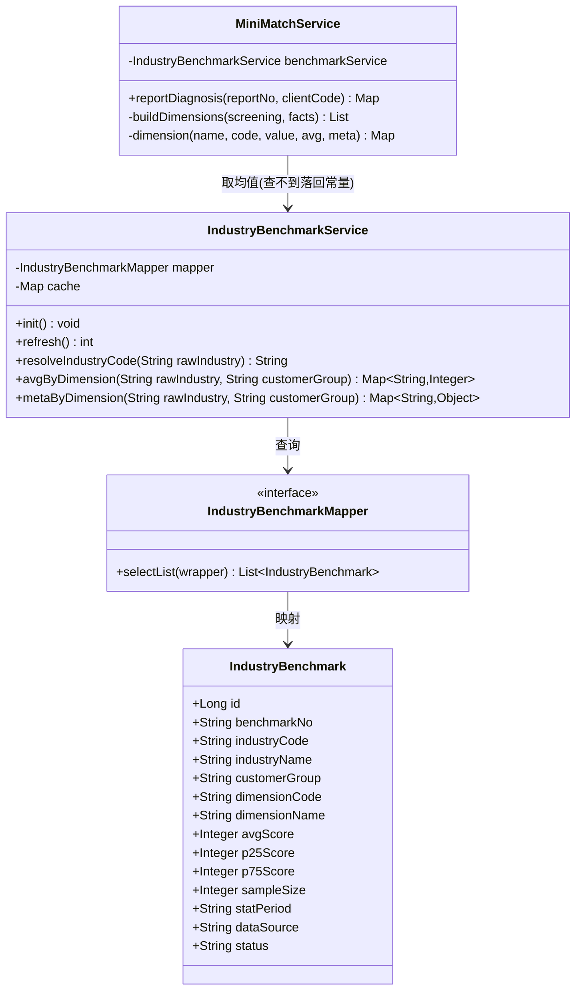
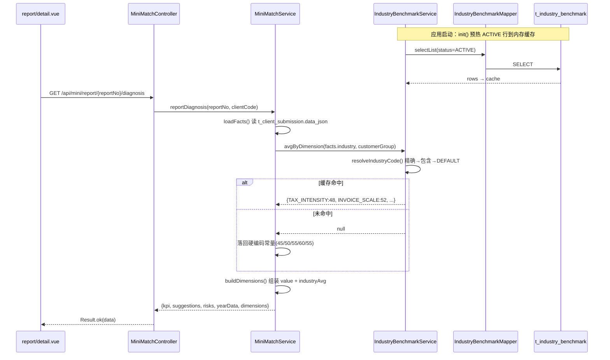
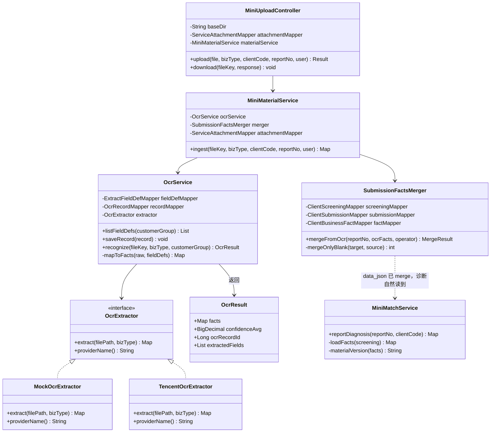
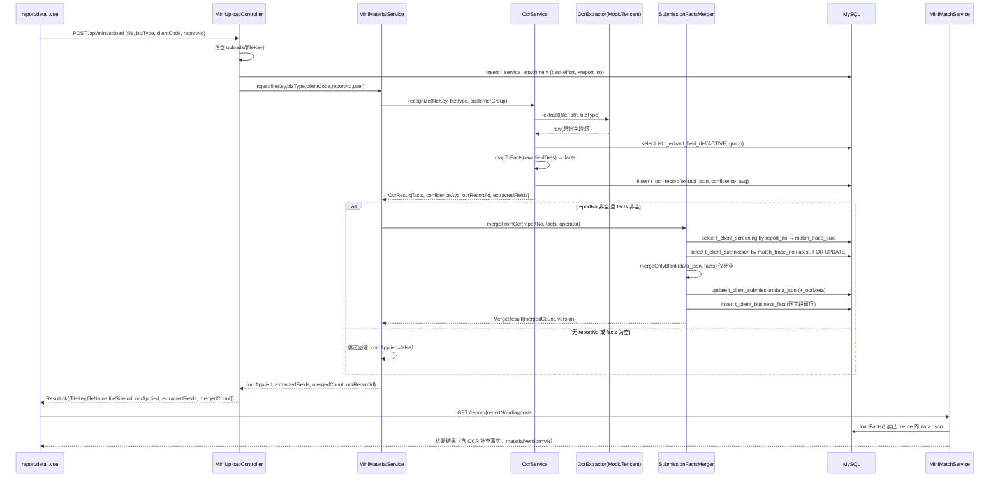
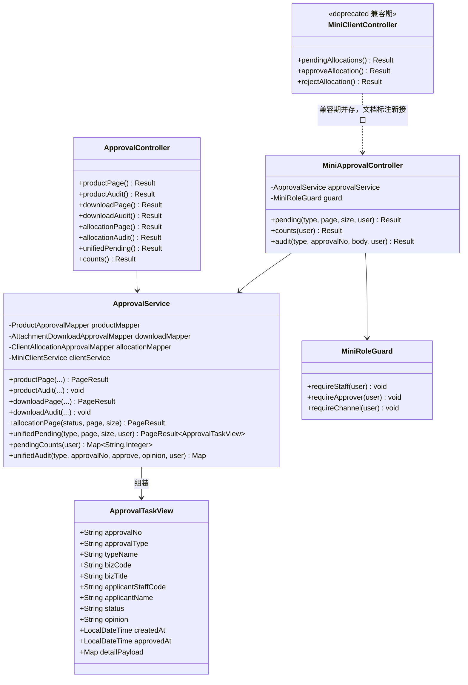
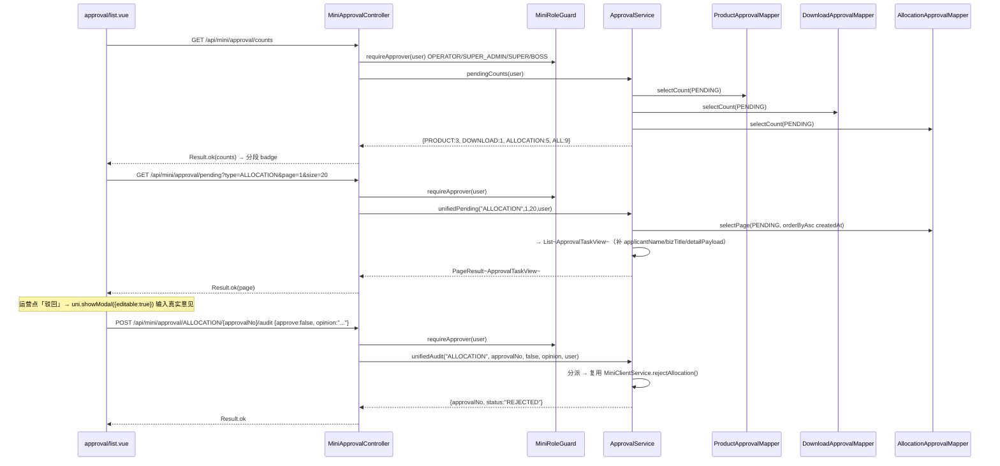
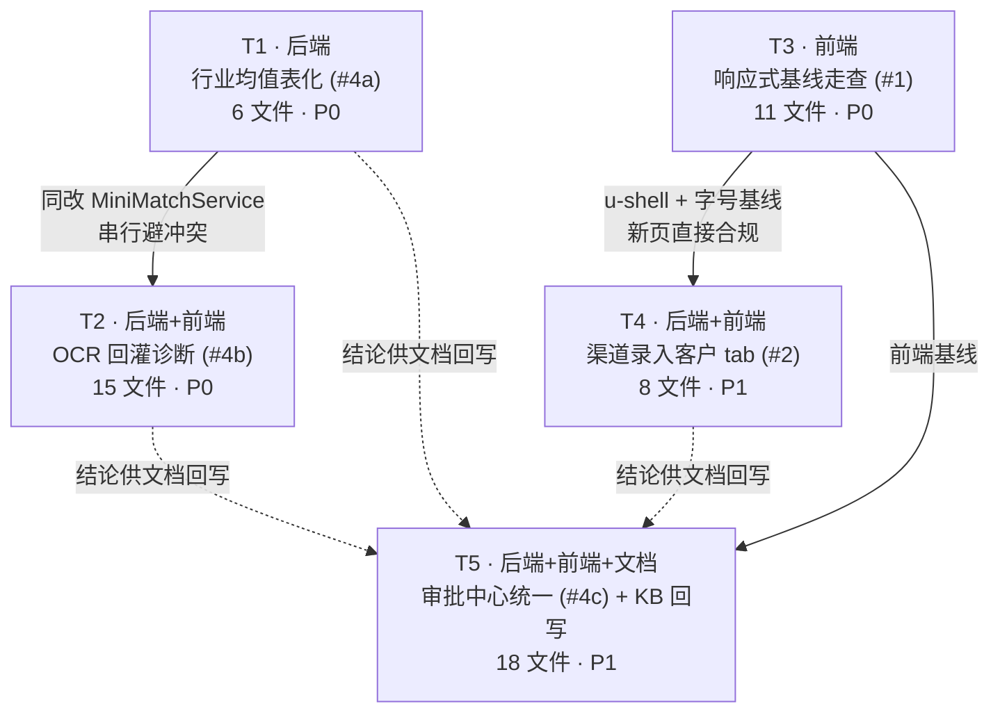

# 遗留项增量设计（2026-08-30）

> **作者**：架构师（高见远）
> **范围**：4 项遗留项增量设计 —— #1 320px/平板走查、#2 渠道「录入客户」tab、#4a 行业均值数据源、#4b OCR 回灌诊断、#4c 分配审批统一审批中心
> **不在本轮**：#3 上线 3 配置（AppID / urlCheck / HTTPS）—— 本轮明确跳过
> **前置阅读**：`docs/knowledge-base/README.md` → `02-业务红线` → `03-数据模型` → `04-后端 API 契约` → `05-前端工程要点` → `08-角色功能矩阵` → `09-业务流程知识图谱`（已按序读毕）
> **本文性质**：**设计文档，不含实现代码**。工程师按 §6 全局有序任务清单分批实现。

---

## 0. 勘察结论汇总（事实基线，先看这张表）

| 项 | 静态勘察结论 | 意外发现 |
|----|--------------|---------|
| #1 | 前端 rpx / Token 化已高度合规（C18/C29 已扫过）。**真实硬编码 px 仅 1 处**；溢出防御（`min-width:0` / `flex-wrap` / ellipsis）已普遍到位 | ① **平板端缺口**：H5 已限宽 600px（`App.vue:205-218`），但被 `#ifdef H5` 隔离 → **mp-weixin 在 iPad（windowWidth>768）完全无限宽**；② **7 处 <22rpx 字号**在 320px 屏折算 7.7~9.0px；③ `match.vue:257` 文案「单文件 ≤ 20MB」与后端 `application.properties:84` 的 10MB **不一致** |
| #2 | `MiniClientController.create` 走 `requireStaff()`（L164-174），**L168-170 显式对 `TYPE_CHANNEL` 抛 FORBIDDEN** → 渠道**不能**用 `createClient` | **已有可用替代**：`MiniLeadController.submit`（`POST /api/mini/lead/submit`）仅要求已登录 → 渠道可用。且 `db/loan-db-schema.sql:1085` 的 `t_lead.source` 注释**已给出业务口径**：「渠道VIP录入不归属直接进公海」→ 归属问题 schema 层已有答案 |
| #4a | `MiniMatchService.java:544-564` `buildDimensions()/dimension()` 的 `industryAvg` 是**硬编码常量**（45/50/55/60/55）；L367/L543 注释自认「行业数据接入前用常量」 | `facts.industry` 是**用户自由文本**（`match.vue:201` placeholder「如：制造业」）；`t_client_profile` **无 industry 列**，仅 `t_lead_ent_ext.industry` 有（schema:1112）→ 需名称归一化层 |
| #4b | `MiniUploadController.upload`（L64-113）只落盘 + best-effort 写 `t_service_attachment`，**无 OCR 调用、无 facts 回灌**；`OcrService` 只有 `listFieldDefs`/`saveRecord`，**无 `recognize()`** | **当前是假闭环**：`report/detail.vue:325-344` 上传后立即 `loadDiagnosis()`，但后端 `data_json` 毫无变化 → 用户看到「诊断将刷新」而数据不变。另 `match.vue:453-457` 的 `materials` 状态（已核验/需补充）是**硬编码假数据** |
| #4c | `grep -rl "ApprovalCenter\|approval_center\|t_approval_task\|统一审批"` → **0 命中**。`approval/` 包仅 3 个**独立**实体；`ApprovalController`（`/api/admin/approval`）只暴露 product + download，**分配审批不在其中**（在 `MiniClientController:109-145`） | **结论：无统一审批中心**。小程序 `pages/approval/list.vue`（149 行）+ `mine.vue:87-94,300-302` 入口**已存在**（KB 08「审批中心无入口」已过期，需回写）。另 `approval/list.vue:88` **驳回意见硬编码**，运营无法填写真实意见 —— 缺陷 |

---

## 1. #1 · 320px 小屏 / 平板走查（前端 QA + 修复）

### 1.1 做法

rpx 天然等比自适应，因此 320px 与平板的问题**不来自 rpx 本身**，而来自 4 类：
（a）非 rpx 字面量；（b）rpx 字号在窄屏折算后低于可读下限；（c）`#ifdef H5` 隔离导致小程序端缺失宽屏治理；（d）文案与后端配置不一致。
逐类给出定位与修复口径，**不做大规模重写**。

### 1.2 问题清单（文件:行号:现象:修复建议）

#### A 类 · 硬编码 px（真实项 1 处 + 白名单 1 处）

| 文件:行号 | 现象 | 修复建议 |
|-----------|------|---------|
| `/Users/admin/Downloads/loan-main/loan-mini/pages/index/index.vue:590` | `letter-spacing:1px` —— 唯一非 rpx 字面量（dev 落地页 `.dev-tag`） | 改 `letter-spacing:2rpx`（1px@375 ≈ 2rpx） |
| `/Users/admin/Downloads/loan-main/loan-mini/components/AppTopBar.vue:61` | `height: var(--status-bar-height, 44px)` | **白名单，不改**。`--status-bar-height` 由 uni-app 以 px 注入，兜底值必须同单位 |

#### B 类 · 极小字号（320px 折算 < 10px，违反可读性）

换算：320px 屏 750rpx = 320px → **1rpx = 0.4267px**

| 文件:行号 | 当前 | 320px 折算 | 修复建议 |
|-----------|------|-----------|---------|
| `pages/index/index.vue:587`（`.dev-tag`） | 18rpx | **7.7px** | → 22rpx |
| `pages/index/index.vue:383` | 20rpx | **8.5px** | → 22rpx |
| `pages/index/index.vue:565` | 20rpx | **8.5px** | → 22rpx |
| `pages/match/match.vue:834` | 20rpx | **8.5px** | → 22rpx（注意同行有 `letter-spacing:4rpx`，提字号后需复核不换行） |
| `components/TabBar.vue:109`（`.tab-label`） | 21rpx | **9.0px** | → 22rpx（`var(--fs-xs)`）；**#2 加第 4 个 tab 后此项必改** |
| `pages/auth/auth.vue:414` | 21rpx | **9.0px** | → 22rpx |
| `pages/home/home.vue:567` | 21rpx | **9.0px** | → 22rpx |

**机制化收口**（推荐，避免复发）：在 `App.vue` Token 区新增 `--fs-xxs: 22rpx` 并在 `05-前端工程要点.md` 写明「**字号下限 22rpx，禁止页面内出现 < 22rpx 字面量**」。
其余 22rpx / 23rpx 共 22 处（`report/list.vue:481,515,528`；`index.vue:334,557,593,664`；`mine.vue:380,416,420,454,492,531`；`match.vue:864,873`；`auth.vue:274,287,386`；`home.vue:308,328,371,422,460,538`；`order/detail.vue:187`）**折算 9.4~9.8px，达下限，本轮不动**（改动面过大且已是设计基线）。

#### C 类 · 平板（>768px）—— **本项最大缺口**

| 文件:行号 | 现象 | 修复建议 |
|-----------|------|---------|
| `App.vue:205-218` | `@media (min-width:768px){ uni-page-body{max-width:600px} }` 被 `/* #ifdef H5 */` 包裹 | **保留**（H5 侧已正确） |
| `components/TabBar.vue:120-130` | 同上，`#ifdef H5` 内 `max-width:600px` | **保留** |
| **缺口** | mp-weixin 在 iPad / 折叠屏展开态（`windowWidth` 可达 1024+）**无任何限宽**；rpx 等比放大 → 字号/间距/卡片整体过大，一屏信息量骤降 | 新增 **JS 驱动的 viewport 机制**（见 §1.3） |

#### D 类 · 文案与配置不一致

| 文件:行号 | 现象 | 修复建议 |
|-----------|------|---------|
| `pages/match/match.vue:257` | 「单文件 ≤ 20MB」 | 后端 `loan-service/src/main/resources/application.properties:84-85` 为 **10MB** → 文案改「≤ 10MB」（或后端调 20MB，二者取一，建议改文案） |

#### E 类 · 已验证**无风险**（明确记录，避免工程师重复排查）

| 位置 | 结论 |
|------|------|
| `index.vue:409-412` `.invite-input{flex:1 1 0; min-width:0}` | 已有 `min-width:0`，与 `.bind-btn{min-width:176rpx}` 同行不溢出 ✅ |
| `components/AppListItem.vue:93,115-117` | `.app-li__main{flex:1;min-width:0}` + `.app-li__meta{flex-wrap:wrap}` ✅ |
| `report/list.vue:468-484` | `.item-no` ellipsis + `flex:1`，`.item-tag` `flex-shrink:0` ✅ |
| `index.vue:306,313` / `mine.vue:341` / `home.vue:263` / `match.vue:782,786,892` 的 320/360/280/260rpx | 均为**装饰圆**，父级 `overflow:hidden` ✅ |
| `match.vue:718` `grid-template-columns:repeat(2,1fr)` | 瓦片内宽 ≈320rpx，材料名最长 4 字（26rpx=104rpx）✅ |
| `TabBar` 渠道加第 4 tab | 每 tab 187.5rpx = 80px@320；「录入客户」4 字 × 22rpx = 88rpx = 37.5px ✅ 不挤 |

#### F 类 · 需真机/模拟器走查确认（静态分析无法定论，交付时必测）

1. iPhone SE 1 代（320×568，无安全区）—— `env(safe-area-inset-bottom)` 返回 0，`.content` padding 是否仍留够 TabBar 高度
2. iPad（mp-weixin）—— §1.3 机制生效后是否居中、TabBar 是否跟随限宽
3. 折叠屏展开/折叠切换 —— `onResize` 是否重算 viewport

### 1.3 平板机制设计（C 类修复方案）

小程序端 wxss 虽支持 `@media (min-width)`，但**本项目已用 `#ifdef H5` 隔离全部 media query**（红线：wxss 不支持 `:root`/`:hover`/`prefers-reduced-motion`，KB 02 末）。为避免破坏既有隔离约定，采用 **JS 驱动 class** 方案：

```
uni.getSystemInfoSync().windowWidth
        │
        ▼
store/user.js  →  viewport { width, isTablet(≥768), isNarrow(≤320) }
        │                    （onLaunch 初始化 + onResize 重算）
        ├──▶ 各 tab 页根节点 :class="{'u-shell': store.isTablet}"
        └──▶ TabBar 根节点   :class="{'is-tablet': store.isTablet}"
```

- `App.vue` 全局样式新增（**不放在 media query 内**，靠 class 命中，双端通用）：
  `.u-shell { max-width: 600px; margin: 0 auto; }`
  `.tab-bar.is-tablet { max-width:600px; left:50%; right:auto; transform:translateX(-50%); }`
- **关键**：`max-width` 用 **px**（不随 rpx 放大），正是限宽所需
- H5 侧现有 `@media` 块**保留不动**（双保险，且 H5 的 `uni-page-body` 是框架元素，class 不易挂载）

### 1.4 涉及文件

| 文件（绝对路径） | 新建/修改 | 说明 |
|------------------|-----------|------|
| `/Users/admin/Downloads/loan-main/loan-mini/App.vue` | 修改 | 加 `--fs-xxs:22rpx`；加 `.u-shell` / `.tab-bar.is-tablet`；`onLaunch` 初始化 viewport |
| `/Users/admin/Downloads/loan-main/loan-mini/store/user.js` | 修改 | 新增 `viewport` state + `isTablet`/`isNarrow` getter + `setViewport()` action |
| `/Users/admin/Downloads/loan-main/loan-mini/components/TabBar.vue` | 修改 | 21rpx→22rpx；根节点绑 `is-tablet` class |
| `/Users/admin/Downloads/loan-main/loan-mini/pages/index/index.vue` | 修改 | L590 `1px`→`2rpx`；L383/565/587 字号提到 22rpx |
| `/Users/admin/Downloads/loan-main/loan-mini/pages/match/match.vue` | 修改 | L257 文案 20MB→10MB；L834 字号 20→22rpx |
| `/Users/admin/Downloads/loan-main/loan-mini/pages/auth/auth.vue` | 修改 | L414 21→22rpx |
| `/Users/admin/Downloads/loan-main/loan-mini/pages/home/home.vue` | 修改 | L567 21→22rpx；根节点 `u-shell` |
| `/Users/admin/Downloads/loan-main/loan-mini/pages/mine/mine.vue` | 修改 | 根节点 `u-shell` |
| `/Users/admin/Downloads/loan-main/loan-mini/pages/report/list.vue` | 修改 | 根节点 `u-shell` |
| `/Users/admin/Downloads/loan-main/loan-mini/pages/order/list.vue` | 修改 | 根节点 `u-shell` |
| `/Users/admin/Downloads/loan-main/loan-mini/pages/product/list.vue` | 修改 | 根节点 `u-shell` |

### 1.5 DB DDL / API 变更

无。纯前端。

### 1.6 风险 / 待确认点

1. **`u-shell` 逐页挂载易漏**：6 个 tab 页 + 4 个二级页。替代方案是新建 `components/AppShell.vue` 包裹层，但需改所有页面模板根节点（改动更大）。**建议先用 class，并在 `05-前端工程要点.md` 记录挂载清单**
2. `transform:translateX(-50%)` + `position:fixed` 在 mp-weixin 的兼容性 —— 需真机验证（低风险，常见组合）
3. 22 处 22/23rpx 是否统一提到 24rpx（`--fs-sm`）—— **待产品确认**；提了会明显改变信息密度，本轮建议不动
4. 构建前必须 `mv -f dist/build/{h5,mp-weixin} /tmp/loan-shell-$(date +%s)`（沙盒 safe-delete 拦截，KB 02）

### 1.7 需回写知识库

- `05-前端工程要点.md`：新增「响应式基线」章 —— 字号下限 22rpx、`--fs-xxs`、`u-shell` 机制与挂载清单、平板 600px 限宽双端方案
- `02-业务红线与编码规范.md`「踩坑记录」：追加「`#ifdef H5` 隔离 media query 会导致小程序端丢失宽屏治理 → 宽屏/窄屏差异化必须走 JS + class」

---

## 2. #2 · 渠道「录入客户」tab（前端 + 后端增量）

### 2.1 核查结论（三个必须先讲清的事实）

**(1) TabBar 加第 4 个 tab 的位置**
`components/TabBar.vue` 无 `tabsFor()` 函数，实际是 `tabList` **computed**（L47-62），渠道分支在 **L48-54**：
```
home(首页) → product(我的产品) → mine(我的)
```
加第 4 个 tab 只需在 `product` 与 `mine` 之间插入一项，`icon:'users'`（`AppIcon` 已含 `users`，KB 05 L30 确认，无需扩图标）。同时删除 **L32** 的过期注释「「录入客户」tab 待阶段三线索录入落地后追加）」。

**(2) `createClient` 当前是否仅 STAFF —— 是，且渠道被显式拒绝**
`api/client.js:44 createClient` → `POST /api/mini/client` → `MiniClientController.create`（L65-69）第一行即 `requireStaff(user)`。`requireStaff`（L164-174）：
- L168-170：`if (TYPE_CHANNEL.equals(userType)) throw FORBIDDEN("渠道合作方不可查看或分配客户")`
- L171-173：非 STAFF 一律 FORBIDDEN

→ **渠道走 `createClient` 必然 403**。且 `MiniClientService.create`（L143）写死 `source="MINI_STAFF_CREATE"`、L144 `ownerStaffCode = user.getUserNo()`（渠道无工号）→ 即便放开权限，落库归属也是错的。

**(3) 归属口径 —— schema 已给答案**
`db/loan-db-schema.sql:1085`：
> `source varchar(16) NOT NULL COMMENT '来源(BOSS老板/ADVISER员工顾问/CHANNEL渠道/VIP客户;**渠道VIP录入不归属直接进公海**)'`

→ **渠道录入的客户不归渠道，直接进公海（`owner_staff_id = NULL`）**，由公司员工后续认领（复用 C2 claim 流程）。

### 2.2 设计决策：渠道「录入客户」= **线索录入（Lead）**，不是客户建档（Client）

| 理由 | 依据 |
|------|------|
| 沙箱隔离红线 | KB 09 §6：渠道对 M_MATCH / M_REPORT / M_PRODUCTS / M_ORDER **全部 FORBIDDEN**。客户域（查重/归属/匹配）是员工域，放开会破坏沙箱 |
| schema 已定口径 | `t_lead.source` 含 `CHANNEL` 且注明进公海；`t_client_profile.source` 无 CHANNEL 枚举 |
| 后端改动最小 | `POST /api/mini/lead/submit` 已存在且**仅要求已登录**（`MiniLeadController:38-40`），渠道天然可用 |
| 查重能力现成 | `t_lead.uk_phone_hash_type (phone_hash, lead_type)` 唯一索引已在（schema:1103） |

**否决方案**：新建 `POST /api/mini/channel/client` 或放开 `requireStaff` —— 均会让渠道进入客户域，违反沙箱隔离，且 `owner_staff_code` 无法落值。

### 2.3 后端增量（3 个改动点 + 1 处 bug 修复，**不新建端点**）

**(a) 修 `source` 硬编码 bug**
`MiniLeadService.java:40` 当前写死 `lead.setSource("MINI")` —— **`MINI` 不在 schema 字典（BOSS/ADVISER/CHANNEL/VIP）内**，是既存缺陷。
改为按 `LoanUser.userType` + `roleCode` 派生：
| userType | roleCode | → source | owner_staff_id |
|----------|----------|----------|----------------|
| CHANNEL | — | `CHANNEL` | **NULL（进公海）** |
| STAFF | BOSS | `BOSS` | 本人 |
| STAFF | 其他 | `ADVISER` | 本人 |
| CUSTOMER | — | `VIP` | NULL（进公海） |

**(b) 扩展企业字段落 `t_lead_ent_ext`**
`submit()` 当前只接 `contactName/phone/leadType/remark`。渠道录客户需要 `entName / creditCode / industry / foundYears / annualTaxAmount / annualInvoiceAmount` —— 这些正是 `t_lead_ent_ext`（schema:1108-1120）的列，也正是 #4a 行业均值与诊断的 facts 来源。

**(c) 新增「我录入的线索」查询**
`GET /api/mini/lead/my?page&size` —— 渠道回看自己录入记录（沙箱脱敏：仅返 `leadNo / contactName(脱敏) / entName / phone(掩码) / followStatus / createdAt`，**不返归属人、不返 clientProfileId**）。

**(d) 安全与红线**
- `phone` **AES 加密**写入 + `phone_hash` SHA-256（红线 #4：读取解密须在 Service 手动做，`@TableField typeHandler` 仅写入生效）
- `creditCode` 同样 AES + `credit_code_hash`
- `leadNo` = `BizIdGenerator.generate("lead")`（红线 #3）
- 唯一索引冲突 → 捕获后返回友好文案「该客户已被录入，请联系运营」，**不泄露归属人**（沙箱隔离）

### 2.4 API 变更

| 接口 | 变更 | 权限 |
|------|------|------|
| `POST /api/mini/lead/submit` | **改**：body 增 `entName / creditCode / industry / foundYears / annualTaxAmount / annualInvoiceAmount`（全部可选）；`source` 由后端派生（前端不可传）；响应由 `Result<String>` 改 `Result<Map>`：`{leadNo, duplicated:boolean}` | 已登录（CUSTOMER/STAFF/**CHANNEL**） |
| `GET /api/mini/lead/my` | **新增**：`?page=1&size=10` → `PageResult<Map>`，字段 `leadNo/contactName/entName/phone(掩码)/followStatus/createdAt` | 已登录，**仅返本人录入**（按 `created_by` + `ext_json.recorderNo` 过滤） |

> 响应字段命名遵守 KB 04 红线：`contactName`（非 name）、`entName`（非 enterpriseName）。

### 2.5 涉及文件

| 文件（绝对路径） | 新建/修改 | 说明 |
|------------------|-----------|------|
| `/Users/admin/Downloads/loan-main/loan-service/src/main/java/com/loan/mini/controller/MiniLeadController.java` | 修改 | `submit` 增字段 + 传 `LoanUser`；新增 `GET /my` |
| `/Users/admin/Downloads/loan-main/loan-service/src/main/java/com/loan/mini/service/MiniLeadService.java` | 修改 | `source` 派生逻辑；AES/SHA 处理；写 `t_lead_ent_ext`；`myLeads()`；唯一索引冲突兜底 |
| `/Users/admin/Downloads/loan-main/loan-service/src/main/java/com/loan/lead/entity/LeadEntExt.java` | **需先确认存在性**，缺则新建 | 映射 `t_lead_ent_ext`（schema:1108-1120） |
| `/Users/admin/Downloads/loan-main/loan-service/src/main/java/com/loan/lead/mapper/LeadEntExtMapper.java` | 同上 | MyBatis-Plus Mapper |
| `/Users/admin/Downloads/loan-main/loan-mini/api/lead.js` | **新建** | `submitLead(payload)` / `myLeads(page,size)` |
| `/Users/admin/Downloads/loan-main/loan-mini/pages/client/create.vue` | **新建** | 录入表单 + 「我录入的线索」列表段 + `<TabBar current="client" />` |
| `/Users/admin/Downloads/loan-main/loan-mini/pages.json` | 修改 | 注册 `pages/client/create`（`navigationBarTitleText:"录入客户"`） |
| `/Users/admin/Downloads/loan-main/loan-mini/components/TabBar.vue` | 修改 | 渠道分支插第 3 项 `{key:'client',label:'录入客户',icon:'users',url:'/pages/client/create'}`；删 L32 过期注释 |

### 2.6 前端页面设计（`pages/client/create.vue`）

```
┌─ 录入客户（渠道）────────────────┐
│ 提示条：录入的客户进入公司公海，   │
│ 由顾问跟进（沙箱隔离说明）         │
├─ 基本信息 ──────────────────────┤
│ 联系人 *      [input]             │
│ 手机号 *      [input type=number] │
│ 客群          [ENTERPRISE/PERSONAL]│
├─ 企业信息（客群=ENTERPRISE 时展开）┤
│ 企业名称      [input]             │
│ 统一社会信用代码 [input]           │
│ 行业          [input]             │
│ 成立年限 / 年纳税额 / 年开票额     │
├─ 需求备注     [textarea]          │
│              [ 提交录入 ]         │
├─ 我录入的线索（分页列表）──────────┤
│ 张三 138****0001 · 待跟进 · 08-30 │
└─ TabBar current="client" ─────────┘
```

**前端红线自查（KB 02 踩坑）**：
- 禁 `<text>` 嵌套 `<text>` → 必填 `*` 用 sibling `<text class="req"> *</text>`
- placeholder 禁含 `{` / `"`
- `:focus` 样式必须 `#ifdef H5` 隔离
- 禁 `*` / `+` 选择器；表单行等宽用 `.row view, .row button { flex:1 }`
- 全部 rpx + Token；字号 ≥ 22rpx（§1.2 B 类）
- `.content` 加 `padding-bottom: calc(var(--space-16) + env(safe-area-inset-bottom))`（自绘 TabBar 遮挡，KB 02）
- 根节点挂 `u-shell`（§1.3）
- tab 切换用 `uni.reLaunch`（禁 `switchTab`）

### 2.7 依赖顺序

**依赖 §1（T3）的 `u-shell` + 字号基线先落地**，否则新页需二次返工。后端 (a)(b)(c) 无外部依赖，可并行。

### 2.8 风险 / 待确认点（**需业务方拍板**）

| # | 待确认 | 架构建议 |
|---|--------|---------|
| 1 | **渠道录入线索是否真的不归属渠道？** schema 注释说进公海，但渠道有奖励诉求（成交返佣） | 建议：归属=公海（不变），但 `ext_json` 记 `recorderChannelNo`，成交时用于奖励归因（`reward` 域已有 DEAL 自动结算）。**需产品确认奖励口径** |
| 2 | 渠道能否看到自己录入线索的 `followStatus`？ | 建议：**能看状态，不看归属人**。状态是渠道最基本的交付反馈；归属人属公司内部信息 |
| 3 | 渠道录入是否需要「查重前置」（先查后录）？ | 建议：**不需要**。渠道不可见客户域，前置查重等于泄露客户名单。改为提交时唯一索引兜底 + 友好文案 |
| 4 | `t_lead.phone` 是 `varchar(256)` AES 加密列 —— `LeadService.create` 现有实现是否已做 AES？ | **实现前必须确认**。若未做，本轮需补，否则 `phone_hash` 与明文不一致会导致查重失效 |
| 5 | 是否复用 OCR 自动填企业名/信用代码（营业执照）？ | 与 #4b 天然复用 `OcrExtractor`。建议**本轮不做**，留作 T2 完成后的增量 |
| 6 | tab 文案「录入客户」vs「录客户」—— 4 字在 320px 已验证不挤（§1.2 E 类） | 用「录入客户」 |

### 2.9 需回写知识库

- `04-后端 API 契约.md`：`POST /api/mini/lead/submit` 参数扩展 + 权限含 CHANNEL；新增 `GET /api/mini/lead/my`
- `05-前端工程要点.md`：TabBar 渠道 4 tab（首页/我的产品/录入客户/我的），`current="client"` 取值
- `08-小程序角色功能矩阵.md`：「录入客户（线索）」渠道列 ❌待阶段三 → **✅（公海）**
- `09-业务流程知识图谱.md` + `.json`：`M_LEAD` 模块补 `CAN_ACCESS: R2(渠道)=ALLOWED`；接口节点 L1 更新，新增 L2(`lead/my`)
- `06-业务结论沉淀索引`：新增 **C20 渠道线索录入（归属=公海，沙箱隔离脱敏，source 字典修正）**
- `03-数据模型.md`：`t_lead` / `t_lead_ent_ext` 加入关键表清单

---

## 3. #4a · 行业均值数据源（后端）

### 3.1 现状定位

| 位置 | 现状 |
|------|------|
| `MiniMatchService.java:544-556` `buildDimensions()` | 5 维度（纳税强度/开票规模/经营时长/财务健康/综合匹配），每维 `dimension(name, value, **avg**)` |
| `MiniMatchService.java:550-554` | avg 实参 = **硬编码字面量 45 / 50 / 55 / 60 / 55** |
| `MiniMatchService.java:558-564` `dimension()` | `m.put("industryAvg", avg)` |
| L367 / L543 注释 | 「industryAvg 为预设行业基准（行业数据接入前用常量）」—— 自认技术债 |
| 行业字段 | `facts.get("industry")` 为**用户自由文本**（`match.vue:201`）；`t_client_profile` **无 industry 列**；`t_lead_ent_ext.industry` 有 |

→ **来源 = 硬编码，无配置、无表**。

### 3.2 做法

新建 `t_industry_benchmark`（行业 × 客群 × 维度 × 统计周期 的均值表），+ `IndustryBenchmarkService` 提供**归一化查询**，`buildDimensions` 改为查表、**查不到落回现有常量**（保证零回归）。

```
facts.industry("制造业")
      │
      ▼ resolveIndustryCode()  ① 空→DEFAULT ② 精确匹配 industry_name
      │                        ③ 双向包含匹配 ④ 兜底 DEFAULT
      ▼
IndustryBenchmarkService.avgByDimension(industryCode, customerGroup)
      │  内存缓存 Map<industryCode+group, Map<dimCode,Integer>>
      ▼
buildDimensions()  →  dimensions[].industryAvg（查表值）
                      dimensions[].sampleSize / benchmarkSource（新增，可选）
```

### 3.3 DB DDL

`/Users/admin/Downloads/loan-main/db/migrate-industry-benchmark.sql`（新建）

```sql
DROP TABLE IF EXISTS `t_industry_benchmark`;
CREATE TABLE `t_industry_benchmark` (
  `id` bigint NOT NULL AUTO_INCREMENT COMMENT '主键ID',
  `benchmark_no` varchar(64) NOT NULL COMMENT '基准编号(业务ID:benchmark+32位随机)',
  `industry_code` varchar(32) NOT NULL COMMENT '行业编码(GB/T4754门类,如C=制造业;DEFAULT=全行业兜底)',
  `industry_name` varchar(64) NOT NULL COMMENT '行业名称(用于自由文本归一化匹配)',
  `customer_group` varchar(16) NOT NULL DEFAULT 'ENTERPRISE' COMMENT '客群(ENTERPRISE企业/PERSONAL个人)',
  `dimension_code` varchar(32) NOT NULL COMMENT '维度编码(TAX_INTENSITY纳税强度/INVOICE_SCALE开票规模/OPERATE_YEARS经营时长/FINANCIAL_HEALTH财务健康/MATCH_OVERALL综合匹配)',
  `dimension_name` varchar(32) NOT NULL COMMENT '维度名称(与前端展示文案一致)',
  `avg_score` int NOT NULL COMMENT '行业均值(0-100归一化,诊断多维统计对比基线)',
  `p25_score` int DEFAULT NULL COMMENT '25分位(预留分层展示)',
  `p75_score` int DEFAULT NULL COMMENT '75分位(预留分层展示)',
  `sample_size` int DEFAULT NULL COMMENT '样本量(数据可信度提示)',
  `stat_period` varchar(16) NOT NULL COMMENT '统计周期(如2026H1/2025Y,同维度可多版本并存)',
  `data_source` varchar(32) NOT NULL DEFAULT 'MANUAL' COMMENT '数据来源(MANUAL人工维护/INTERNAL内部样本统计/EXTERNAL第三方)',
  `status` varchar(16) NOT NULL DEFAULT 'ACTIVE' COMMENT '状态(ACTIVE生效/DISABLED停用)',
  `created_by` varchar(64) DEFAULT NULL COMMENT '创建人姓名',
  `updated_by` varchar(64) DEFAULT NULL COMMENT '更新人姓名',
  `created_at` datetime NOT NULL DEFAULT CURRENT_TIMESTAMP COMMENT '创建时间',
  `updated_at` datetime NOT NULL DEFAULT CURRENT_TIMESTAMP ON UPDATE CURRENT_TIMESTAMP COMMENT '更新时间',
  PRIMARY KEY (`id`),
  UNIQUE KEY `uk_benchmark_no` (`benchmark_no`),
  UNIQUE KEY `uk_ind_group_dim_period` (`industry_code`,`customer_group`,`dimension_code`,`stat_period`),
  KEY `idx_industry_status` (`industry_code`,`status`),
  KEY `idx_dim_status` (`dimension_code`,`status`)
) ENGINE=InnoDB DEFAULT CHARSET=utf8mb4 COLLATE=utf8mb4_0900_ai_ci
  COMMENT='行业基准均值(经营诊断多维统计对比基线;DEFAULT行兜底,替代MiniMatchService硬编码常量)';
```

**种子数据要求**（同一 SQL 内）：
- `DEFAULT / 全行业` × ENTERPRISE × 5 维度 —— avg 取现有常量（45/50/55/60/55），保证**上线即等价现状**
- 6 个主行业 × ENTERPRISE × 5 维度 = 30 行：制造业(C) / 批发和零售业(F) / 建筑业(E) / 交通运输仓储和邮政业(G) / 信息传输软件和信息技术服务业(I) / 住宿和餐饮业(H)
- `stat_period='2026H1'`，`data_source='MANUAL'`，`benchmark_no` 由 SQL 侧生成占位（或提供 Java 初始化脚本用 `BizIdGenerator`）

> **注**：`benchmark_no` 严格遵红线 #3 应由 `BizIdGenerator.generate("benchmark")` 生成。种子 SQL 内可用 `CONCAT('benchmark', REPLACE(UUID(),'-',''))` 截 32 位近似，并在 §3.7 记录「后续 CRUD 必须走 BizIdGenerator」。

**另需**：`/Users/admin/Downloads/loan-main/db/loan-db-schema.sql`（修改）—— 在「二、匹配域之 2.6 初筛报告」后追加本表定义，表数 65 → **66**。

### 3.4 类结构（Mermaid）



### 3.5 调用时序（Mermaid）



### 3.6 涉及文件

| 文件（绝对路径） | 新建/修改 |
|------------------|-----------|
| `/Users/admin/Downloads/loan-main/db/migrate-industry-benchmark.sql` | **新建**（DDL + 35 行种子） |
| `/Users/admin/Downloads/loan-main/db/loan-db-schema.sql` | 修改（追加表定义，65→66 表）<br>【实施后勘误 2026-08-31】实际 schema 为 68 张 t_ 表（t_industry_benchmark 原已存在，非本次新增），以 db/loan-db-schema.sql 为准。 |
| `/Users/admin/Downloads/loan-main/loan-service/src/main/java/com/loan/report/entity/IndustryBenchmark.java` | **新建** |
| `/Users/admin/Downloads/loan-main/loan-service/src/main/java/com/loan/report/mapper/IndustryBenchmarkMapper.java` | **新建** |
| `/Users/admin/Downloads/loan-main/loan-service/src/main/java/com/loan/report/service/IndustryBenchmarkService.java` | **新建** |
| `/Users/admin/Downloads/loan-main/loan-service/src/main/java/com/loan/mini/service/MiniMatchService.java` | 修改（L544-564 + 构造注入） |

> 归入 `report/` 域：经营诊断属报告域（KB 00「report/ 报告域」）。

### 3.7 API 变更

- `GET /api/mini/report/{reportNo}/diagnosis` —— **响应结构向后兼容**：`dimensions[].industryAvg` 类型不变（int），前端**零改动**
- 新增可选字段（兼容期前端可忽略）：`dimensions[].dimensionCode`、`dimensions[].sampleSize`、`dimensions[].benchmarkSource`（`DB` / `FALLBACK`）
- **本轮不做管理端 CRUD**（红线 #1 不碰 loan-web；后端 CRUD 无前端消费方，先靠 SQL 维护）

### 3.8 风险 / 待确认点

1. **行业归一化准确率**：自由文本「制造」「机械制造」「制造业(通用设备)」→ 双向包含匹配可覆盖大部分，但「贸易」≠「批发和零售业」。**建议 T4 让渠道/员工录入时行业改为 picker 选择**（与 §2 联动），根治文本歧义
2. **均值数据真实性**：本轮为 MANUAL 人工基线，非统计结果。前端若展示「行业均值」需注明口径，避免合规风险（业务文案禁「放款」类承诺，同理均值需标「参考基准」）
3. **缓存刷新**：`@PostConstruct` 预热 + `refresh()` 方法。如需定时刷新**必须走 XXL-Job**（红线 #2 禁 `@Scheduled`），建议新建 `report/job/IndustryBenchmarkRefreshJob.java`（P2，可延后）
4. `customerGroup` 来源：`t_client_profile.customer_group` 或 `t_client_submission.customer_group`，`reportDiagnosis` 当前**未取该字段** → 实现时需从 submission 或 client 补读
5. `INTERNAL` 数据源（用自家样本统计均值）需样本量门槛（建议 ≥30）才启用，否则失真

### 3.9 需回写知识库

- `03-数据模型.md`：关键表清单增 `t_industry_benchmark`；表数 65 → 66
- `04-后端 API 契约.md`：diagnosis 响应新增可选字段说明
- `06-业务结论沉淀索引`：C5 经营诊断章追加「行业均值已表化，DEFAULT 兜底 + 常量二次兜底」
- `02-业务红线`：追加「行业均值等基准数据禁硬编码，统一走 `t_industry_benchmark`」

---

## 4. #4b · OCR 材料解析驱动诊断（后端 + 前端）

### 4.1 现状链路（含**假闭环**认定）

```
前端 uploadMaterial(filePath,{bizType,clientCode})        api/upload.js:26
   → POST /api/mini/upload                                MiniUploadController:64
       → 落盘 uploads/{fileKey}{suffix}                    L77-87
       → best-effort insert t_service_attachment           L90-101（失败仅 warn）
       → return {fileKey,fileName,fileSize,url}            L103-108
   ✗ 无 OCR 调用    ✗ 无 facts 回灌    ✗ 无 report 关联

前端 report/detail.vue:325-344 onUploadMaterial
   → uploadMaterial(...)
   → toast「材料已上传，诊断将刷新」
   → loadDiagnosis(reportNo)
       → GET /report/{reportNo}/diagnosis
           → MiniMatchService.reportDiagnosis:373
               → loadFacts():397 读 t_client_submission.data_json（按 matchTraceNo）
   ⚠ data_json 未变 → 诊断结果与上传前完全一致 → **假闭环**
```

**OcrService 现状**（`ocr/service/OcrService.java`）：只有 `listFieldDefs(customerGroup)`（L34-43）与 `saveRecord(record)`（L50-54）。L16-18 注释：「阶段一识别走模拟…真实识别后续迭代接策略工厂（对齐 tse OcrStrategyFactory）」→ **无 `recognize()` 方法**。
`OcrController`（`/api/admin/ocr`）仅 `GET /field-defs` + `POST /record`，非自动链路。
`t_extract_field_def.extract_rule_json`（schema:621）已预留「从提交资料映射到事实字段」的规则位 —— **正是映射层的设计意图**。

### 4.2 做法（3 层，可分期，本轮全做但 OCR 引擎用可插拔 Mock）

```
┌─ L1 上传绑定 ────────────────────────────────────────┐
│ POST /api/mini/upload 增可选参数 reportNo             │
│ MiniMaterialService.ingest(fileKey,bizType,clientCode,│
│                            reportNo,user)             │
│   ① 写 t_ocr_record（bizScene/fileKey/operatorType）  │
└──────────────────┬───────────────────────────────────┘
                   ▼
┌─ L2 OCR 识别（可插拔）───────────────────────────────┐
│ OcrService.recognize(fileKey,bizType,customerGroup)   │
│   → OcrExtractor（接口）                              │
│      ├ MockOcrExtractor（默认，返回空/文件名解析）     │
│      └ TencentOcrExtractor（@ConditionalOnProperty）   │
│   → 按 t_extract_field_def.extract_rule_json 映射     │
│      OCR原始字段 → facts key                          │
│      (annualTaxAmount/annualInvoiceAmount/foundYears/  │
│       industry/entName/creditCode)                    │
│   → 回填 t_ocr_record.extract_json + confidence_avg   │
└──────────────────┬───────────────────────────────────┘
                   ▼
┌─ L3 回灌诊断（核心）─────────────────────────────────┐
│ SubmissionFactsMerger.mergeFromOcr(reportNo,ocrFacts) │
│   ① reportNo → t_client_screening.match_trace_uuid    │
│   ② → t_client_submission（match_trace_no，取最新）    │
│   ③ data_json 反序列化，**仅补空不覆盖用户手填值**     │
│   ④ 写回 data_json + 内嵌 _ocrMeta{fileKeys,mergedAt, │
│      version,source:'OCR'}                            │
│   ⑤ 同步写 t_client_business_fact（提取层留痕）        │
│   ⑥ 不新建 submission（避免 uk_client_submit_id 冲突） │
└──────────────────┬───────────────────────────────────┘
                   ▼
   诊断 loadFacts() 无需改动（data_json 已被 merge）
   materialVersion 由固定 "v1" 改为按 _ocrMeta.version 递增
```

**「仅补空不覆盖」规则**（关键设计约束）：用户手填 facts 权威性高于 OCR。合并条件 = 目标 key 不存在 / 为 null / 为空串 / 数值为 0。**永不覆盖非空用户输入**。人工修正走 `t_ocr_record.manual_fix_json`（已预留，本轮不做入口）。

### 4.3 类结构（Mermaid）



### 4.4 调用时序（Mermaid）



### 4.5 DB DDL（2 条列级迁移）

`/Users/admin/Downloads/loan-main/db/migrate-ocr-diagnosis.sql`（新建）

```sql
-- (1) t_ocr_record 补业务编码列（红线#3：不用主键做查询）
ALTER TABLE `t_ocr_record`
  ADD COLUMN `biz_code` varchar(64) DEFAULT NULL
      COMMENT '关联业务编码(业务ID:reportNo/clientCode/productCode;替代biz_id物理主键查询)' AFTER `biz_id`,
  ADD COLUMN `updated_at` datetime NOT NULL DEFAULT CURRENT_TIMESTAMP ON UPDATE CURRENT_TIMESTAMP
      COMMENT '更新时间(识别结果二次回填/人工修正)' AFTER `created_at`,
  ADD KEY `idx_scene_biz_code` (`biz_scene`,`biz_code`);

-- (2) t_service_attachment 补报告关联（诊断补充材料需按报告回溯）
ALTER TABLE `t_service_attachment`
  ADD COLUMN `report_no` varchar(64) DEFAULT NULL
      COMMENT '关联初筛报告编号(业务ID:report+32位随机;诊断补充材料场景)' AFTER `client_profile_code`,
  ADD KEY `idx_report_no` (`report_no`);
```

> `t_client_business_fact`（schema:594-606）**无需改表**，现有 `field_code/field_value/field_type/extract_time` 足够。
> 注意其 `client_profile_id`/`submission_id` 是 bigint 物理 ID —— 与红线 #3 有历史张力，本轮**沿用不动**（避免连锁改造），在 §4.9 记录为技术债。

### 4.6 API 变更

| 接口 | 变更 |
|------|------|
| `POST /api/mini/upload` | **增可选参数** `reportNo`；**响应增字段** `ocrApplied:boolean` / `extractedFields:[{fieldCode,fieldName,value,confidence}]` / `mergedCount:int` / `ocrRecordId:long`。原有 4 字段不变 → **向后兼容** |
| `GET /api/mini/report/{reportNo}/diagnosis` | `materialVersion` 语义变化：固定 `"v1"` → `_ocrMeta.version` 递增（`v1`/`v2`…）。前端 `detail.vue:118` 已展示 `generatedAt`，可同步展示版本 |
| `POST /api/mini/report/{reportNo}/reingest` | **P2 可选新增**：对该报告已上传附件批量重跑 OCR + 回灌（供 OCR 引擎从 Mock 切真实后补算）。权限：客户校验归属 / 员工全量 |

**配置新增**（`application.properties`）：
```
loan.ocr.provider=mock          # mock | tencent
loan.ocr.enabled=true           # 关闭时 ingest 直接跳过，仅落附件
loan.ocr.merge-only-blank=true  # 仅补空不覆盖（默认 true，勿关）
```

### 4.7 涉及文件

| 文件（绝对路径） | 新建/修改 |
|------------------|-----------|
| `/Users/admin/Downloads/loan-main/db/migrate-ocr-diagnosis.sql` | **新建** |
| `/Users/admin/Downloads/loan-main/loan-service/src/main/java/com/loan/mini/controller/MiniUploadController.java` | 修改（增 `reportNo` 参数 + 注入 `MiniMaterialService` + 响应扩字段 + attachment 落 `report_no`） |
| `/Users/admin/Downloads/loan-main/loan-service/src/main/java/com/loan/mini/service/MiniMaterialService.java` | **新建** |
| `/Users/admin/Downloads/loan-main/loan-service/src/main/java/com/loan/ocr/service/OcrService.java` | 修改（新增 `recognize()` + `mapToFacts()`） |
| `/Users/admin/Downloads/loan-main/loan-service/src/main/java/com/loan/ocr/service/OcrExtractor.java` | **新建**（接口） |
| `/Users/admin/Downloads/loan-main/loan-service/src/main/java/com/loan/ocr/service/impl/MockOcrExtractor.java` | **新建** |
| `/Users/admin/Downloads/loan-main/loan-service/src/main/java/com/loan/ocr/model/OcrResult.java` | **新建**（DTO） |
| `/Users/admin/Downloads/loan-main/loan-service/src/main/java/com/loan/ocr/entity/OcrRecord.java` | 修改（加 `bizCode` / `updatedAt` 字段） |
| `/Users/admin/Downloads/loan-main/loan-service/src/main/java/com/loan/submission/service/SubmissionFactsMerger.java` | **新建** |
| `/Users/admin/Downloads/loan-main/loan-service/src/main/java/com/loan/attachment/entity/ServiceAttachment.java` | 修改（加 `reportNo` 字段） |
| `/Users/admin/Downloads/loan-main/loan-service/src/main/java/com/loan/mini/service/MiniMatchService.java` | 修改（`materialVersion` 由 `_ocrMeta` 派生，L386） |
| `/Users/admin/Downloads/loan-main/loan-service/src/main/resources/application.properties` | 修改（3 个 `loan.ocr.*` 配置） |
| `/Users/admin/Downloads/loan-main/loan-mini/api/upload.js` | 修改（`uploadMaterial` 增 `reportNo`） |
| `/Users/admin/Downloads/loan-main/loan-mini/pages/report/detail.vue` | 修改（L325-344 传 `reportNo`；按 `ocrApplied` 差异化 toast） |
| `/Users/admin/Downloads/loan-main/loan-mini/pages/match/match.vue` | 修改（L464-500 上传成功后用 `extractedFields` **仅补空**回填表单；L453-457 `materials` 假状态改为上传结果驱动） |

### 4.8 依赖顺序

L1 → L2 → L3 严格串行（同一 PR 内也按此顺序写）。
与 §3（#4a）**无依赖**，但两者都改 `MiniMatchService` → **建议 T1（#4a）先完成再做 T2（#4b）**，避免同文件冲突。

### 4.9 风险 / 待确认点

| # | 风险/待确认 | 处置 |
|---|-------------|------|
| 1 | **OCR 供应商未定**（腾讯云 OCR / 通义 VL 的密钥、配额、单价） | 本轮只落**可插拔接口 + Mock + 完整回灌链路**。真实引擎按 `loan.ocr.provider` 切换，不阻塞本轮交付 |
| 2 | **并发写 `data_json`**：同一报告多材料并发上传 → 读-改-写丢失 | `mergeFromOcr` 加 `@Transactional(rollbackFor=Exception.class)` + 查 submission 时 `.last("for update")`（MySQL 行锁）。**必须实现，否则数据丢失** |
| 3 | `t_client_business_fact.client_profile_id` / `submission_id` 是 bigint 物理 ID（与红线 #3 张力） | 本轮沿用，记为技术债；后续统一迁 `*_code` 时一并处理 |
| 4 | Mock 阶段 `ocrApplied` 恒为 false → 前端「已识别 N 项」不会出现 | 前端必须**双分支文案**：`ocrApplied=true`→「已识别 N 项，诊断已刷新」；`false`→「材料已上传，人工核验后更新」。**不要再出现假承诺文案** |
| 5 | `t_extract_field_def` 是否已有种子数据？`extract_rule_json` 规则格式未定义 | **实现前必须确认表内数据**。若为空需一并出种子（映射规则 JSON schema 建议：`{"sourceKeys":["纳税总额","年度纳税"],"transform":"YUAN","targetFactKey":"annualTaxAmount"}`） |
| 6 | 上传文件大小 10MB 对财务报表 PDF 可能不足 | 与 §1 D 类联动：**要么文案改 10MB，要么后端调 20MB**。建议后端调 20MB（`multipart.max-file-size/request-size`）+ 文案保持 20MB，反而改动更小 —— **待产品确认** |
| 7 | `bizScene` 映射：`bizType` 6 值（ID_CARD/BUSINESS_LICENSE/FINANCIAL_STATEMENT/CONTRACT/DUE_DILIGENCE/OTHER）→ `t_ocr_record.biz_scene` 3 值（CLIENT_AUTH/CLIENT_SUBMIT/CHANNEL_PRODUCT） | 映射表：ID_CARD/BUSINESS_LICENSE→`CLIENT_AUTH`；FINANCIAL_STATEMENT/CONTRACT/DUE_DILIGENCE/OTHER→`CLIENT_SUBMIT`；渠道上传→`CHANNEL_PRODUCT`。需在代码注释固化 |
| 8 | 红线 #5：`OcrStrategyFactory` 只借鉴 tse **范式**，不得引入 tse 业务动作 | 只做「按 provider 选实现」的工厂范式，不复制 tse 的外呼/拨号等业务 |

### 4.10 需回写知识库

- `04-后端 API 契约.md`：`POST /api/mini/upload` 增 `reportNo` 参数 + 4 个响应字段；diagnosis 的 `materialVersion` 语义
- `03-数据模型.md`：`t_ocr_record` 增 `biz_code`/`updated_at`；`t_service_attachment` 增 `report_no`；`t_client_business_fact` 提为关键表
- `06-业务结论沉淀索引`：新增 **C21 OCR 材料解析回灌诊断（三层链路 / 仅补空不覆盖 / Mock 可插拔 / _ocrMeta 版本）**
- `02-业务红线`：追加「facts 合并铁律：OCR 只补空，永不覆盖用户手填」+「上传后回灌必须 `for update` 串行」
- `09-业务流程知识图谱.md` + `.json`：`M_DIAG` 增 `READS t_ocr_record`；新增边 `M_MATCH --上传--> M_DIAG`（OCR 回灌）

---

## 5. #4c · 分配审批统一审批中心迁移（后端 + 前端）

### 5.1 搜索结论：**无统一审批中心**

| 搜索 | 结果 |
|------|------|
| `grep -rl "ApprovalCenter\|approval_center\|t_approval_task\|统一审批"` on `loan-service/src/main/java` | **0 命中** |
| `db/loan-db-schema.sql` 中 `CREATE TABLE .*approval` | 仅 3 张：`t_product_approval:776` / `t_attachment_download_approval:892` / `t_client_allocation_approval:1182` |
| `approval/` 包 | 3 实体 + 3 Mapper + 1 Service + 1 Controller，**无聚合抽象** |
| `ApprovalController`（`/api/admin/approval`） | 只有 `product/*`（page/detail/audit）+ `download/*`（apply/page/audit/void）。**分配审批完全不在其中** |
| 分配审批实际位置 | `mini/controller/MiniClientController.java:109-145`（`/api/mini/client/allocation-approvals/*`） |

**另发现（KB 08 已过期，需回写）**：小程序审批入口**已存在** —— `pages/approval/list.vue`（149 行，已对接 pending/approve/reject）+ `pages/mine/mine.vue:87-94, 300-302`（运营/超管/老板可见）+ `pages.json:80` 已注册。KB 08 第 18/21 行「审批中心无入口 / 小程序没有入口页」是陈旧结论。

### 5.2 结论与方案选择

> **结论：无统一审批中心表/机制。本轮建议「视图层统一 + 入口统一」（方案 A），不建新表、不迁移数据。**

| 方案 | 内容 | 评估 |
|------|------|------|
| **A（推荐）** | 保留 3 张独立表，新增 `ApprovalTaskView` DTO 做**读模型统一**；`ApprovalService` 增 `unifiedPending/pendingCounts/unifiedAudit` 分派；新增 `MiniApprovalController`（`/api/mini/approval/*`）；小程序 `approval/list.vue` 改为分类型分段 | 零数据迁移、零状态机破坏、不碰 loan-web；约 1.5 人日 |
| B（不推荐本轮） | 新建 `t_approval_task` + `t_approval_node`（多级审批），三类审批迁入 | ① 三类业务字段差异大（产品有 `apply_type` 五态状态机、下载有 `attachment_ids` + 24h 限时链接、分配有 `client_code` 归属流转）→ 合表产生大量 NULL 列；② `t_product_approval` 已被 C9 状态机（DRAFT→PENDING→OK→PENDING_DELETE）深度耦合，迁移会打断；③ 必然要求 Web 端配套改造 → **触碰红线 #1**；④ ≥3 人日 |

→ **建议 A，并把 B 记入阶段四规划**（届时审批类型 >5 且需多级/会签时再统一建表）。

### 5.3 方案 A 类结构（Mermaid）



### 5.4 调用时序（Mermaid）



### 5.5 DB DDL

**无建表、无迁移**（方案 A 的核心价值）。

### 5.6 API 变更

**新增（小程序端）**
| 接口 | 说明 | 权限 |
|------|------|------|
| `GET /api/mini/approval/counts` | 三类待审计数 `{PRODUCT,DOWNLOAD,ALLOCATION,ALL}` | STAFF + OPERATOR/SUPER_ADMIN/SUPER/BOSS |
| `GET /api/mini/approval/pending?type=ALL\|PRODUCT\|DOWNLOAD\|ALLOCATION&page&size` | 统一待审列表（`PageResult<ApprovalTaskView>`） | 同上 |
| `POST /api/mini/approval/{type}/{approvalNo}/audit` | body `{approve:boolean, opinion:string}`；`approve=false` 时 `opinion` 必填 | 同上 |

**新增（管理端后端，补 Web 缺口；不改 loan-web 前端）**
| 接口 | 说明 |
|------|------|
| `GET /api/admin/approval/allocation/page?status&keyword&page&size` | 分配审批分页（Web 端当前完全缺失） |
| `POST /api/admin/approval/allocation/{approvalNo}/audit` | 分配审批通过/驳回（`@OpLog(bizType="分配审批", action="AUDIT")`） |
| `GET /api/admin/approval/unified/pending?type&page&size` | 统一待审 |
| `GET /api/admin/approval/counts` | 三类计数 |

**保留兼容期（标 `@Deprecated` + 文档标注）**
`GET /api/mini/client/allocation-approvals/pending`、`POST .../approve`、`POST .../reject` —— 前端已在用（`api/client.js:82-105`），C19 兼容期不删；Javadoc 指向新接口。

**分页语义约定（必须写进契约）**
`type=ALL` 时**跨 3 表无法精确分页**。约定：`ALL` 模式各表取前 `size` 条，按 `createdAt` 内存归并后截 `size`，`total` = 三表 PENDING 计数之和，**并在响应加 `paginationHint:"SEGMENTED"`**，前端 `type=ALL` 只做「概览 + 引导按类型进入」，不做深翻页。

### 5.7 涉及文件

| 文件（绝对路径） | 新建/修改 |
|------------------|-----------|
| `/Users/admin/Downloads/loan-main/loan-service/src/main/java/com/loan/approval/model/ApprovalTaskView.java` | **新建**（统一读模型 DTO） |
| `/Users/admin/Downloads/loan-main/loan-service/src/main/java/com/loan/approval/service/ApprovalService.java` | 修改（增 `allocationPage` / `unifiedPending` / `pendingCounts` / `unifiedAudit`，**复用**既有三套审批逻辑不重写） |
| `/Users/admin/Downloads/loan-main/loan-service/src/main/java/com/loan/approval/controller/ApprovalController.java` | 修改（补 allocation 段 + unified 段） |
| `/Users/admin/Downloads/loan-main/loan-service/src/main/java/com/loan/mini/controller/MiniApprovalController.java` | **新建**（`/api/mini/approval`） |
| `/Users/admin/Downloads/loan-main/loan-service/src/main/java/com/loan/mini/service/MiniRoleGuard.java` | **新建**（抽 `requireStaff`/`requireApprover`/`requireChannel`，消除 `MiniClientController:150-174` 与其他 Mini*Controller 的重复） |
| `/Users/admin/Downloads/loan-main/loan-service/src/main/java/com/loan/mini/controller/MiniClientController.java` | 修改（3 个 allocation 接口标 `@Deprecated` + Javadoc 指新接口；`requireStaff/requireApprover` 改委派 `MiniRoleGuard`） |
| `/Users/admin/Downloads/loan-main/loan-mini/api/approval.js` | **新建**（`approvalCounts()` / `pendingApprovals(type,page,size)` / `auditApproval(type,approvalNo,approve,opinion)`） |
| `/Users/admin/Downloads/loan-main/loan-mini/pages/approval/list.vue` | 修改（类型分段 tab + 计数 badge；**驳回意见改为可输入** `uni.showModal({editable:true, placeholderText:'请输入驳回意见'})`，修 L88 硬编码缺陷；改用 `api/approval.js`） |
| `/Users/admin/Downloads/loan-main/loan-mini/pages/mine/mine.vue` | 修改（菜单文案「分配审批」→「审批中心」+ 待审计数 badge） |
| `/Users/admin/Downloads/loan-main/loan-mini/api/client.js` | 修改（3 个 allocation 函数加 `@deprecated` JSDoc，指向 `api/approval.js`） |

### 5.8 依赖顺序

后端 `MiniRoleGuard` → `ApprovalTaskView` → `ApprovalService` → 两个 Controller → 前端 `api/approval.js` → `approval/list.vue` → `mine.vue`。
前端部分**依赖 §1（T3）**的 `u-shell` + 字号基线。

### 5.9 风险 / 待确认点

| # | 风险/待确认 | 处置 |
|---|-------------|------|
| 1 | `type=ALL` 跨表分页不精确 | 已在 §5.6 约定 `paginationHint:"SEGMENTED"` + 前端不深翻页。**需产品确认可接受** |
| 2 | `uni.showModal({editable:true})` 兼容性 | 微信小程序基础库 2.17.1+ 支持；H5 端 uni-app 亦支持。**低版本兜底**：`fail` 回调时降级为跳转到独立驳回页或用预设意见列表 |
| 3 | 产品审批 / 下载审批的**审批人权限口径可能不同**于分配审批 | `ApprovalService.productAudit`/`downloadAudit` 现在 `/api/admin/**` 下由 `AdminAuthInterceptor` 统一鉴权（BOSS/DEPT_MANAGER/OPERATOR/SUPER_ADMIN/SUPER）；分配审批是 OPERATOR/SUPER_ADMIN/SUPER/BOSS（**不含 DEPT_MANAGER**）。**统一入口需按 type 分别校验**，不能用单一 guard 一刀切 → `MiniRoleGuard` 需提供 `requireApproverFor(type, user)` |
| 4 | 产品/下载审批放到小程序端是否合规？（涉及银行产品与无水印附件） | **建议本轮 `type` 白名单先只放 `ALLOCATION`**，`PRODUCT`/`DOWNLOAD` 接口备好但小程序端灰度关闭（配置 `loan.mini.approval.types=ALLOCATION`）。**需产品/合规确认** |
| 5 | 是否需要审批历史（已通过/已驳回）列表 | 本轮只做 pending。历史列表建议随 Web 端一起做（P2） |
| 6 | 红线 #1：不碰 loan-web | 本设计**只加后端接口**，不改 loan-web 任何前端文件。Web 端接入由用户另行决策 |

### 5.10 需回写知识库

- `04-后端 API 契约.md`：新增「审批中心（统一）」章 —— 3 个 `/api/mini/approval/*` + 4 个 `/api/admin/approval/*`；旧 3 接口标已废弃（兼容期）；写明 `ALL` 分页语义
- `08-小程序角色功能矩阵.md`：**修正陈旧结论** —— 「分配审批中心（C19 待审列表页）」由「小程序没有入口页」改为「✅ 已有 `pages/approval/list.vue` + mine 入口」；新增行「审批中心（统一：产品/下载/分配）」
- `06-业务结论沉淀索引`：新增 **C22 审批中心统一（结论：无统一审批表，采用视图层统一；方案 B 建表迁移列入阶段四）**
- `03-数据模型.md`：三张审批表关系说明 + 「不合表」的架构决策记录
- `09-业务流程知识图谱.md` + `.json`：`M_ALLOC` 模块扩为「审批中心」，补 `HAS_API` 新接口节点；`CAN_ACCESS` 补 DEPT_MANAGER 对 PRODUCT/DOWNLOAD 的差异
- `02-业务红线`：追加「审批类接口权限按 type 差异化校验，禁一刀切 guard」

---

## 6. 全局有序任务清单（供工程师分批实现）

> 排序原则：① 纯后端增量优先（无前端依赖，可独立验证）；② 同文件冲突项串行（T1/T2 都改 `MiniMatchService`）；③ 前端响应式基线先落地，再做新页（避免新页返工）；④ 文档回写随最后一批交付。

| # | 任务 | 端 | 覆盖遗留项 | 预估文件数 | 依赖 | 优先级 |
|---|------|-----|-----------|-----------|------|--------|
| **T1** | **行业均值数据源表化**<br>`t_industry_benchmark` DDL + 35 行种子 → `IndustryBenchmark` 实体/Mapper/Service（含 `resolveIndustryCode` 归一化 + 内存缓存）→ `MiniMatchService.buildDimensions` 改查表、查不到落回原常量 → schema 65→66 表<br>【实施后勘误 2026-08-31】实际 schema 为 68 张 t_ 表（t_industry_benchmark 原已存在，非本次新增），以 db/loan-db-schema.sql 为准。 | 后端 | #4a | **6**<br>（新建 4 / 修改 2） | 无 | **P0** |
| **T2** | **OCR 解析回灌诊断（打通假闭环）**<br>迁移 SQL（`t_ocr_record.biz_code/updated_at`、`t_service_attachment.report_no`）→ `OcrExtractor` 接口 + `MockOcrExtractor` + `OcrResult` → `OcrService.recognize/mapToFacts` → `MiniMaterialService.ingest` → `SubmissionFactsMerger.mergeFromOcr`（**仅补空 + `for update`**）→ `MiniUploadController` 增 `reportNo` + 响应扩字段 → `materialVersion` 版本化 → 前端 `upload.js` / `report/detail.vue`（双分支文案）/ `match.vue`（`extractedFields` 补空回填 + 去除假 `materials` 状态） | 后端<br>+前端 | #4b | **15**<br>（新建 6 / 修改 9） | T1（同改 `MiniMatchService`，串行避冲突） | **P0** |
| **T3** | **响应式基线走查修复**<br>`App.vue` 加 `--fs-xxs:22rpx` + `.u-shell` + `.tab-bar.is-tablet` + `onLaunch` 初始化 viewport → `store/user.js` 加 `viewport`/`isTablet`/`isNarrow` → 7 处 <22rpx 字号提到 22rpx → `index.vue:590` `1px`→`2rpx` → `match.vue:257` 文案对齐后端上传上限 → 6 个 tab 页根节点挂 `u-shell` → 构建校验（`mv dist` 后 `npm run build:mp-weixin` + `build:h5`，grep `((!))` 为 0、无 `:hover/:root/:focus/@media` 泄漏到 wxss） | 前端 | #1 | **11**<br>（全部修改） | 无 | **P0** |
| **T4** | **渠道「录入客户」tab**<br>后端：`MiniLeadService` 修 `source` 硬编码 bug（`MINI`→字典派生）+ AES/SHA 敏感字段 + 写 `t_lead_ent_ext` + `myLeads()` + 唯一索引冲突兜底；`MiniLeadController` `submit` 扩字段 + 新增 `GET /my`；`LeadEntExt` 实体/Mapper（**先确认存在性**）<br>前端：`TabBar.vue` 渠道插第 3 tab（`users` 图标）+ 删 L32 过期注释 → `pages/client/create.vue` 新建（表单 + 我录入的线索 + TabBar）→ `api/lead.js` 新建 → `pages.json` 注册 | 后端<br>+前端 | #2 | **8**<br>（新建 4 / 修改 4） | **T3**（`u-shell` + 字号基线；新页直接合规） | **P1** |
| **T5** | **审批中心统一 + 知识库回写**<br>后端：`MiniRoleGuard`（含 `requireApproverFor(type,user)` 差异化）→ `ApprovalTaskView` → `ApprovalService.allocationPage/unifiedPending/pendingCounts/unifiedAudit`（复用既有逻辑）→ `MiniApprovalController`（`/api/mini/approval/*`，type 白名单配置）→ `ApprovalController` 补 allocation + unified 段 → `MiniClientController` 旧接口 `@Deprecated`<br>前端：`api/approval.js` 新建 → `approval/list.vue` 类型分段 + 计数 badge + **驳回意见可输入**（修 L88 硬编码）→ `mine.vue` 文案改「审批中心」+ badge → `api/client.js` 加 `@deprecated`<br>文档：回写 `02/03/04/05/06/08/09` 七份知识库（含**修正 KB 08 陈旧结论**） | 后端<br>+前端<br>+文档 | #4c + 全部文档 | **18**<br>（新建 4 / 修改 14） | **T3**（前端基线）、T1/T2/T4（文档回写需其结论） | **P1** |

**总计**：约 58 个文件触点（新建 18 / 修改 40）。

### 6.1 任务依赖图



### 6.2 每批交付验收口径

| 任务 | 后端验收 | 前端验收 |
|------|---------|---------|
| T1 | `cd loan-service && mvn -o compile` 通过；DEFAULT 行存在时 diagnosis 的 `industryAvg` 与改造前**逐值相等**（零回归） | 无 |
| T2 | `mvn -o compile` 通过；Mock 下 `ocrApplied=false` 且**不报错**；构造一条 facts 缺 `foundYears` 的 submission，注入 Mock 返回值后 `data_json` 只补 `foundYears`、不动已有值 | `report/detail.vue` 上传后文案按 `ocrApplied` 分支；`match.vue` 回填不覆盖用户输入 |
| T3 | 无 | `mv -f dist/build/{h5,mp-weixin} /tmp/loan-t3-$(date +%s)` → `npm run build:mp-weixin` + `npm run build:h5` 双端成功；`grep -rn "((!))" dist/build/mp-weixin` 为 0；wxss 中无 `:hover/:root/:focus/*::before/@media`；开发者工具 iPhone SE(320) + iPad 双模拟器目视无溢出、无过大 |
| T4 | `mvn -o compile` 通过；渠道 Token 调 `POST /api/mini/lead/submit` 返 200 且 `t_lead.source='CHANNEL'`、`owner_staff_id IS NULL`；重复手机号返友好文案不泄归属人 | 渠道角色 TabBar 显示 4 tab；`录入客户` 页提交成功后「我录入的线索」出现该条；320px 下 4 tab 不挤 |
| T5 | `mvn -o compile` 通过；`GET /api/mini/approval/counts` 三类计数正确；`type=ALLOCATION` 列表与旧接口结果一致；旧 3 接口仍可用（兼容期） | `approval/list.vue` 分段切换正常；驳回时能输入真实意见并落 `approve_opinion`；`mine.vue` badge 显示待审数 |

### 6.3 全局风险清单（跨任务）

| 风险 | 影响任务 | 处置 |
|------|---------|------|
| 沙盒 vite 清 dist 被 safe-delete 拦截 | T3 / T4 / T5 前端构建 | 构建前 `mv -f dist/build/{h5,mp-weixin} /tmp/loan-xxx-$(date +%s)`（红线 KB 02） |
| 禁用 `npx uni build` | 同上 | 只用 `npm run build:h5` / `npm run build:mp-weixin` |
| 定时任务禁 `@Scheduled` | T1（可选刷新 Job） | 必须 XXL-Job（参考 `partner/job/PartnerProductExpireJob.java`、`lead/job/LeadRecycleJobHandler.java`） |
| 业务 ID 必须 `BizIdGenerator` | T1（`benchmark_no`）、T4（`leadNo`） | 种子 SQL 内 UUID 仅作初始化，运行时 CRUD 一律走 `BizIdGenerator.generate(prefix)` |
| AES 读取解密需 Service 手动做 | T4（`phone`/`creditCode`） | `@TableField typeHandler` 仅写入生效，查询/回显必须手动解密 + 掩码 |
| 参考项目 tse 只借鉴范式 | T2（`OcrStrategyFactory`） | 只抄「按 provider 选实现」的工厂范式，不引入 tse 业务动作 |
| 前后端契约变更纪律 | T2 / T4 / T5 | 改响应字段前先查前端调用方 + 落地清单 + 结论沉淀；字段废弃保留兼容期 |
| Java 8 + javax.servlet | 全部后端 | 禁 Java 9+ API（`List.of`/`var`/`Map.of`）；`javax.*` 不是 `jakarta.*` |
| 离线编译 | 全部后端 | `cd loan-service && mvn -o compile`（`-o` 离线） |

---

## 7. 知识库回写汇总（T5 一次性执行）

| 文档 | 回写内容 |
|------|---------|
| `02-业务红线与编码规范.md` | ① 踩坑：`#ifdef H5` 隔离 media query → 小程序端丢失宽屏治理，差异化必须走 JS+class；② 字号下限 22rpx；③ facts 合并铁律：OCR 只补空永不覆盖 + 回灌须 `for update`；④ 基准数据禁硬编码；⑤ 审批接口权限按 type 差异化，禁一刀切 |
| `03-数据模型（DB schema 索引）.md` | ① 新表 `t_industry_benchmark`（65→**66 表**）<br>【实施后勘误 2026-08-31】实际 schema 为 68 张 t_ 表（t_industry_benchmark 原已存在，非本次新增），以 db/loan-db-schema.sql 为准。 ② `t_ocr_record` 增 `biz_code`/`updated_at`；③ `t_service_attachment` 增 `report_no`；④ `t_client_business_fact` / `t_lead` / `t_lead_ent_ext` 提为关键表；⑤ 三张审批表「不合表」的架构决策记录 |
| `04-后端 API 契约.md` | ① `POST /api/mini/lead/submit` 参数扩展 + 权限含 CHANNEL；② 新增 `GET /api/mini/lead/my`；③ `POST /api/mini/upload` 增 `reportNo` + 4 响应字段；④ diagnosis 响应新增可选字段 + `materialVersion` 语义；⑤ 新增「审批中心（统一）」章（3 mini + 4 admin 接口，`ALL` 分页语义）；⑥ 旧 3 个 allocation-approvals 标已废弃（兼容期） |
| `05-前端工程要点.md` | ① 新增「响应式基线」章（`--fs-xxs`、字号下限、`u-shell` 机制 + 挂载清单、平板 600px 双端方案）；② TabBar 渠道 4 tab + `current="client"` |
| `06-业务结论沉淀索引（C1-C19）.md` | 扩为 C1-C22：**C20** 渠道线索录入（归属=公海/沙箱脱敏/source 字典修正）、**C21** OCR 回灌诊断（三层链路/仅补空/Mock 可插拔/`_ocrMeta` 版本）、**C22** 审批中心统一（视图层统一，建表迁移列阶段四）；C5 追加行业均值表化 |
| `08-小程序角色功能矩阵.md` | ① **修正陈旧结论**：分配审批入口**已存在**（`pages/approval/list.vue` + mine 入口），删除「小程序没有入口页」；② 「录入客户（线索）」渠道列 ❌待阶段三 → ✅（公海）；③ 新增行「审批中心（统一）」 |
| `09-业务流程知识图谱.md` + `.json` | ① `M_LEAD` 补 `CAN_ACCESS R2(渠道)=ALLOWED`，接口节点 L1 更新 + 新增 L2；② `M_DIAG` 补 `READS t_ocr_record`，新增边 `M_MATCH --OCR回灌--> M_DIAG`；③ `M_ALLOC` 扩为「审批中心」+ 新接口节点 + DEPT_MANAGER 权限差异；④ tables 节点增 `t_industry_benchmark`、`t_lead_ent_ext`、`t_client_business_fact` |
| `00-项目结构与代码地图.md` | 表数 65→66；`ocr/` 包补 `service/impl` + `model` |

---

## 8. Anything UNCLEAR（汇总待业务/产品拍板项）

| # | 待确认 | 归属 | 阻塞任务 |
|---|--------|------|---------|
| 1 | 渠道录入线索的**奖励归因**口径（归属=公海，但渠道成交是否返佣？） | 产品/业务 | T4（可先按公海实现，`ext_json.recorderChannelNo` 预留） |
| 2 | `LeadService.create` 是否已对 `t_lead.phone` 做 AES 加密？ | 工程师实现前**必须核查代码** | **T4 强阻塞**（不确认会导致 `phone_hash` 与明文不一致，查重失效） |
| 3 | `t_extract_field_def` 是否已有种子数据？`extract_rule_json` 规则 schema 未定义 | 工程师核查 + 架构补 schema | **T2 强阻塞** |
| 4 | 上传大小：前端文案 20MB vs 后端 10MB —— 改文案还是调后端？ | 产品 | T2 / T3（建议后端调 20MB，改动更小） |
| 5 | OCR 供应商（腾讯云 OCR / 通义 VL）密钥与配额 | 产品/运维 | 不阻塞（本轮 Mock + 可插拔） |
| 6 | 小程序端是否允许审批**产品/下载**（涉银行产品与无水印附件合规） | 产品/合规 | T5（建议先白名单只放 ALLOCATION） |
| 7 | `type=ALL` 按类型分段（不精确分页）是否可接受 | 产品 | T5 |
| 8 | 22 处 22/23rpx 字号是否统一提到 24rpx（会明显改变信息密度） | 设计 | 不阻塞（本轮不动） |
| 9 | 行业字段是否改为 picker 选择（根治自由文本歧义） | 产品 | 不阻塞（T1 用归一化兜底，建议 T4 联动改 picker） |
| 10 | `LeadEntExt` 实体/Mapper 是否已存在？ | 工程师核查 | T4（缺则新建，已计入 8 文件） |

---

**文档结束**。工程师请按 §6 顺序（T1 → T2 → T3 → T4 → T5）分批实现，每批按 §6.2 验收口径自检，遇 §8 阻塞项先回问，勿自行假设。
